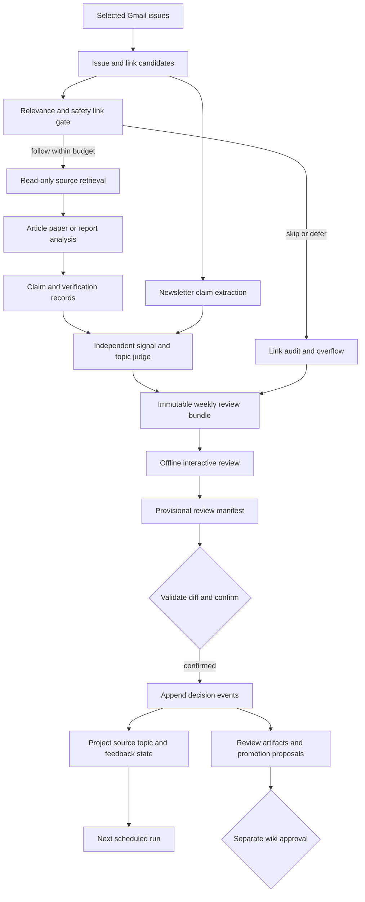

# Newsletter Knowledge Discovery Pipeline V2 - Plan

## Goal Capsule

- **Objective:** Evolve the controlled newsletter pipeline into a weekly knowledge-discovery system that uses selected newsletters to find, evaluate, and deeply analyze valuable linked sources for the Second Brain.
- **Primary outcome:** Durable analytical value from articles, reports, research papers, contradictions, methods, and strategic surprises; email summaries are not the product.
- **Authority hierarchy:** Rolf's confirmed review decisions > confirmed registries and priority context > agent judgment > newsletter and linked-source claims.
- **Execution profile:** Scheduled preparation, offline interactive review, explicit manifest confirmation, and proposal-only wiki promotion.
- **Human review target:** Complete the weekly review in 5 minutes or less; agent processing time is not part of this limit.
- **Stop conditions:** Stop on Gmail identity mismatch, unaccepted staging boundary, unsafe or personalized URL, stale review manifest, exceeded run budget, missing required provenance, or any attempted automatic wiki promotion.

---

## Product Contract

### Summary

The V2 pipeline treats newsletters as curated discovery signals rather than final evidence. It uses the context around newsletter links to decide which external sources are worth opening, reads approved high-value sources at the appropriate depth, and turns them into evidence-aware analyses, signals, topic proposals, and reviewable wiki-change proposals.

The weekly experience is one offline interactive review workspace. Rolf can adjust newsletter eligibility, follow or reject proposed topics, review link decisions and source analyses, correct signals, and approve or reject promotion proposals. Every click remains provisional until one consolidated decision manifest is inspected and explicitly confirmed.

### Problem Frame

V1 safely qualified 122 newsletter streams, created 42 selected newsletter dossiers, and produced a first strategic brief. It proved that the most valuable information is often not in the email itself: five manually followed links produced the strongest source analyses in the pilot.

V1 does not yet make that behavior reproducible. Links lack meaningful newsletter context, link-selection decisions are not auditable, source analysis has no depth contract, signal judging does not consume source analyses, and the review interface only supports newsletter selection. The first feedback loop therefore remains mostly manual.

### Actors

- A1. **Rolf** confirms priorities, source and topic scope, signal feedback, and promotion decisions.
- A2. **Codex newsletter agent** collects selected issues, evaluates link candidates, reads approved external sources, produces analyses, judges signals, and prepares review artifacts.
- A3. **Dedicated Gmail mailbox** remains the authority for newsletter originals and is accessed read-only.
- A4. **External linked source** supplies article, report, paper, data, or official documentation content and is always treated as untrusted input.
- A5. **Second Brain** supplies prior knowledge and receives review artifacts or separately approved wiki changes.
- A6. **Weekly scheduler** starts preparation only; it cannot confirm decisions or promote knowledge.

### Requirements

**Authority, privacy, and source eligibility**

- R1. The V1 read-only Gmail, private staging, provenance, retention, and human-promotion boundaries remain in force.
- R2. Newsletter qualification never opens external links; link following exists only in the weekly enrichment flow for selected sources.
- R3. Selected streams are fully eligible for weekly processing. Unseen or not-selected sources may enter a bounded reconsideration lane but cannot create signals or trigger deep link retrieval until selected.
- R4. Newsletter bodies, linked pages, URLs, redirects, and embedded instructions remain untrusted data and cannot cause forms, logins, downloads, tool actions, Gmail mutation, or wiki edits.
- R5. Full copyrighted page text, raw MIME, authentication data, cookies, personalized tracking tokens, and full newsletter bodies must not be stored in canonical records or durable outputs.

**Priority and topic context**

- R6. Relevance uses five lenses: confirmed active priorities, wiki gaps, contradictions, durable methods, and strategic surprises.
- R7. Because the confirmed alignment contains no concrete business priorities, the first pilot presents a small provisional priority set inferred from active vault areas for Rolf to confirm or edit.
- R8. Inferred priorities remain explicitly provisional and cannot silently become settled personal preferences.
- R9. Topic candidates show their supporting issues, linked sources, overlap with existing wiki pages, uncertainty, and why they may deserve ongoing attention.
- R10. A confirmed topic decision updates a versioned topic-watch registry; it does not create a canonical wiki claim or bypass newsletter-source eligibility.

**Selective link following**

- R11. Every HTTP(S) link from an eligible issue becomes a bounded `link_candidate` with anchor text, surrounding newsletter context, related claim/topic identifiers, original issue/newsletter provenance, inferred source type, and commercial markers.
- R12. Before any retrieval, a link gate records priority fit, primary-source value, expected novelty/depth, contradiction value, commercial discount, expected source type, confidence, and a reasoned `follow`, `skip`, `defer`, or `needs_review` disposition.
- R13. Personalized, credential-bearing, unsubscribe, affiliate, opaque-redirect, unsafe-scheme, localhost, private-network, and credential-bearing targets are blocked before any request unless a non-personal canonical HTTP(S) destination can be derived deterministically, contains no sensitive value, and passes the full gate again. The sensitive original is not persisted.
- R14. Links discovered inside a visited page are never followed recursively without becoming a new candidate and passing a new gate.
- R15. Adaptive weekly research operates within pilot hard limits of ten external retrievals and three deep analyses. Overflow remains visible and prioritized for review. The four-week pilot may propose revised limits.
- R16. Canonical URL and content-hash deduplication consolidate repeated sources while retaining every originating newsletter and issue.

**Source depth and evidence**

- R17. A valuable long article is read across its full accessible structure and receives a substantive, section-aware analysis rather than an abstract-only summary.
- R18. A research paper analysis includes research question, prior context, method, data or sample, results, limitations, important claims with locations, contradictions, and Second Brain relevance.
- R19. A report analysis includes sponsor, methodology, sample or data basis, section-level findings, limitations, commercial incentives, and downstream relevance.
- R20. Source coverage is declared as `full`, `partial`, `paywalled`, or `unavailable`; the analysis must not imply complete coverage when access was incomplete.
- R21. Complete source coverage means complete analytical treatment, not verbatim copying. Durable source analyses use precise provenance, bounded excerpts, and citations.
- R22. Newsletter interpretation, source claims, agent inference, and independent verification remain separate. A newsletter plus its linked vendor page does not constitute independent verification.

**Interactive review and confirmation**

- R23. The weekly offline workspace provides bounded views for top signals, newsletter changes and reconsiderations, topic proposals, link audit and source analyses, promotion proposals, and final confirmation.
- R24. Review actions include source select/reactivate/not-select/undecided, topic follow/ignore/snooze/merge/correct, signal accept/reject/correct/verify/request-promotion, link follow/deepen/defer/reject/correct, and promotion-proposal retain/reject.
- R25. All browser actions remain local and provisional until a consolidated `weekly_review_decisions` manifest is exported, validated, diffed, and explicitly confirmed.
- R26. The `weekly_review_decisions` manifest carries a review ID, period, input and bundle hashes, base registry revisions, action families, reviewer timestamp, and append-only decisions. Integrity uses versioned canonical JSON plus SHA-256 over the immutable review packet, base revisions, review ID, period, and ordered action payload.
- R27. Partial manifests apply as patches and preserve untouched registry entries. Stale revisions, unknown IDs, duplicate actions, invalid hashes, or missing required fields cause zero authoritative writes.
- R28. Source reactivation applies to future issues by default. Historical backfill is a separate bounded opt-in and the interface must disclose when older issue detail has already been pruned.
- R29. Signal corrections and review decisions are preserved inside immutable confirmed `review_event` records. They inform later judging without rewriting original claims or silently generalizing into preferences.

**Outputs and cadence**

- R30. Confirmed review may retain a weekly brief, source analysis, review-status topic dossier, newsletter-dossier update, feedback event, or promotion proposal.
- R31. Source analyses and dossiers remain evidence-aware review artifacts. A retained promotion proposal still cannot change ordinary canonical wiki pages; only a separate `wiki_promotion_apply` approval event may authorize that later operation.
- R32. The scheduler may collect, gate, retrieve, analyze, verify, and prepare the review bundle, but it cannot confirm source/topic decisions or apply wiki promotions.
- R33. Every included brief claim is traceable through signal and claim to its originating newsletter issue. Link-enriched claims additionally trace through source analysis or verification, fetch record, and link gate. Newsletter-only claims remain attributed, unverified unless independently checked, and clearly labeled as newsletter-native evidence.
- R34. Each run is idempotent and resumable by record and phase, with input hashes, policy/profile versions, attempt state, failure details, and explicit invalidation when inputs change.

### Key Flows

- F1. **Weekly discovery preparation**
  - **Trigger:** The weekly scheduler starts a bounded run.
  - **Steps:** Verify Gmail identity and staging boundary, collect new selected-source issues, normalize issue and link candidates, and create checkpoints.
  - **Outcome:** A complete candidate inventory with no Gmail mutation and no external retrieval yet.
  - **Covered by:** R1-R5, R11, R32, R34
- F2. **Link gate and source enrichment**
  - **Trigger:** Eligible link candidates exist.
  - **Steps:** Apply relevance and safety gates, enforce the adaptive budget, retrieve approved targets, classify coverage, analyze by source type, and record overflow or failure.
  - **Outcome:** Auditable source analyses and skip/defer reasons with complete newsletter provenance.
  - **Covered by:** R6-R22
- F3. **Signal and topic judgment**
  - **Trigger:** Newsletter claims and linked-source analyses are available.
  - **Steps:** Extract claims separately from judgment, compare with wiki knowledge and prior corrections, consolidate semantic repeats, preserve contradictions, and propose signals or topics.
  - **Outcome:** A bounded set of decision-relevant signals and topic candidates with evidence status and uncertainty.
  - **Covered by:** R6-R10, R16, R22, R29, R33
- F4. **Interactive weekly review**
  - **Trigger:** A validated review bundle is rendered.
  - **Steps:** Rolf reviews the six bounded views, changes provisional actions, inspects link audit evidence, and exports one manifest.
  - **Outcome:** A complete provisional action set without authoritative changes.
  - **Covered by:** R23-R26
- F5. **Reconciliation and confirmation**
  - **Trigger:** A review manifest is imported.
  - **Steps:** Validate hashes and revisions, show the diff, reject conflicts or invalid actions, require explicit confirmation, append events, and project updated registries atomically.
  - **Outcome:** Confirmed scope and feedback affect the next run; untouched state remains unchanged.
  - **Covered by:** R25-R29
- F6. **Review artifact retention and promotion**
  - **Trigger:** Confirmed actions request retention or promotion.
  - **Steps:** Retain approved review artifacts, update dossier projections, create promotion proposals, and require a separate approval before applying any normal wiki edit.
  - **Outcome:** The Second Brain gains traceable analysis without treating newsletter claims as automatic truth.
  - **Covered by:** R30-R33

### Acceptance Examples

- AE1. Given three newsletters link to one commercial recap and one primary paper, the pipeline consolidates the topic, discounts the recap, reads the paper deeply within budget, lists every link decision, and produces one paper analysis with all newsletter provenance.
- AE2. Given a not-selected newsletter surfaces a uniquely relevant topic, the weekly review can reactivate it. Confirmation makes future issues eligible; historical backfill remains off unless separately approved.
- AE3. Given a source contradicts an existing wiki claim, both positions remain visible, the topic may be followed, and promotion creates a proposed diff without editing the wiki page.
- AE4. Given Rolf corrects a signal, the original signal remains unchanged, the feedback event records the correction, and the next judge cites it as explicit review context rather than a general preference.
- AE5. Given review choices exist only in local browser state, source and topic registries, feedback logs, scheduled runs, and wiki pages remain unchanged.
- AE6. Given a paper is accessible only as an abstract, coverage is `partial`, a full-paper analysis is not claimed, and the missing method/results sections remain explicit.
- AE7. Given the external-retrieval budget is reached, additional candidates are not opened, remain ordered in overflow, and show why higher-value items were preferred.
- AE8. Given a stale or partial manifest, import either applies a valid patch against the expected revision or rejects the entire authoritative write; it never shrinks a registry silently.
- AE9. Given a scheduled run completes without Rolf reviewing it, the review bundle and draft brief may exist, but no selection, topic decision, feedback event, or promotion becomes authoritative.
- AE10. Given a malicious newsletter or webpage instructs the agent to ignore policy, the instruction remains source text, causes no action, and is recorded only if relevant to the security audit.

### Success Criteria

- The weekly review remains within 5 minutes for the normal bounded view.
- At least one retained source analysis per week materially adds depth beyond the newsletter issue when strong sources exist.
- Research paper and report analyses meet their depth contracts and expose incomplete access honestly.
- Every followed and skipped candidate has a reviewable reason and source provenance.
- Confirmed corrections visibly improve later framing without rewriting historical records.
- Source/topic changes and promotion proposals require explicit confirmation and produce zero unintended registry loss or wiki mutation.
- The four-week pilot shows whether useful knowledge gained exceeds unnecessary retrievals, missed links, review burden, and false-positive analyses.

### Scope Boundaries

- No indiscriminate crawling, recursive browsing, or following every newsletter link.
- No links opened during initial or reconsideration qualification.
- No bypass of paywalls, logins, robots restrictions, or access controls.
- No full-text archive of copyrighted web pages in the vault.
- No automatic source selection, topic confirmation, personal-priority confirmation, or canonical wiki promotion.
- No background daemon. Scheduling uses the Codex automation layer only after the manual V2 run passes all gates.
- No historical backfill when reactivating a source unless Rolf explicitly approves a bounded window.

### Assumptions and Resolved Decisions

- The V2 plan is a new artifact because the V1 plan documents an already-built safety and qualification baseline.
- The first priority context remains provisional until Rolf confirms concrete priorities; wiki-gap, contradiction, durable-method, and strategic-surprise lenses continue to operate meanwhile.
- The initial pilot ceiling is ten external retrievals and three deep analyses per weekly run.
- The weekly page audits work already prepared by the agent; it does not browse directly.
- Topic following changes monitoring scope, not durable truth.
- Source reactivation is future-only by default.

### Sources and Research

- `docs/plans/2026-07-03-001-feat-controlled-newsletter-intelligence-pipeline-plan.md`
- `skills/newsletter-intelligence/SKILL.md`
- `skills/newsletter-intelligence/references/gmail-collection.md`
- `skills/newsletter-intelligence/references/record-contracts.md`
- `skills/newsletter-intelligence/references/signal-judging.md`
- `skills/newsletter-intelligence/assets/review-workspace.html`
- `tools/newsletter-intelligence.ps1`
- `tests/newsletter-intelligence/`
- `wiki/_outputs/newsletter-intelligence/briefs/2026-07-05-weekly-strategic-intelligence.md`
- `wiki/newsletters/*/linked-sources/`

---

## Planning Contract

### Key Technical Decisions

- KTD1. **Preserve two distinct workflows.** Qualification remains a no-navigation source-selection process. Weekly knowledge discovery is a separate selected-source enrichment workflow with its own reference, records, and review surface.
- KTD2. **Use canonical JSON and derived HTML/Markdown.** Agent and UI share immutable bundles and exported manifests, not mutable browser state. `localStorage` may preserve drafts only.
- KTD3. **Use immutable confirmed manifests plus revisioned registry patches for the pilot.** Each confirmed weekly manifest is the append-only audit record; partial actions patch current source/topic registries through one journaled commit protocol. Readers accept only the registry revisions named by the latest valid commit marker, and incomplete commits recover or roll back before another import. Fully replayable event projections are deferred until the pilot demonstrates a history-query or multi-writer need.
- KTD4. **Gate before every external access.** Link extraction and relevance/safety judgment produce a canonical gate record before retrieval. Redirects and newly discovered links re-enter the same gate.
- KTD5. **Make adaptive finite.** The pilot evaluates all candidates cheaply, retrieves at most ten targets, performs at most three deep analyses, and exposes overflow. Budget changes are confirmed policy changes.
- KTD6. **Separate retrieval, analysis, claims, verification, and judgment.** Each phase has its own status and provenance. A source analysis may improve understanding without verifying the newsletter.
- KTD7. **Store complete analytical coverage, not copied full text.** Detailed source notes cover the accessible argument and evidence structure while using bounded excerpts and citations.
- KTD8. **Keep topic control separate from knowledge promotion.** `topic_registry.json` controls watch scope; topic dossiers are review artifacts until a separate promotion is approved.
- KTD9. **Use future-only reactivation by default.** Pruned history cannot be assumed available. Historical backfill is an explicit, bounded secondary action.
- KTD10. **Schedule preparation, not authority changes.** Automation can prepare the review bundle and draft outputs, but confirmation and wiki application remain human-only.
- KTD11. **Stage before retaining source analyses.** Unconfirmed analyses remain in private per-run staging. A confirmed review event may publish selected analyses under `wiki/_outputs/newsletter-intelligence/source-analyses/`; existing linked-source notes remain intact and are linked for backward compatibility.
- KTD12. **Make every phase idempotent and invalidatable.** Checkpoints include run, phase, input hash, policy/profile versions, attempt state, and failure. Changed content or policy invalidates dependent outputs visibly.
- KTD13. **Prove the retrieval boundary before selecting the adapter.** A capability spike must demonstrate per-hop destination validation, explicit redirects, final-byte or stable-snapshot access, MIME and decompressed-size reporting, timeout control, and content hashing. Codex browsing/document tools may be selected only if they expose every required hook; otherwise a constrained deterministic HTTP/PDF fetcher must provide the boundary and pass the same adversarial fixtures before live enrichment.
- KTD14. **Enforce retrieval-analysis capability isolation.** Retrieval receives only a validated gate and may produce only a bounded fetch record and private snapshot. Analysis runs in a separate invocation or sandbox with an explicit tool allowlist and receives only delimited snapshot content; Gmail, navigation, forms, downloads, shell, and ordinary wiki writes must be unavailable at the capability layer. If the runtime cannot prove this boundary, live enrichment stops rather than relabeling procedural instructions as isolation.

### High-Level Technical Design

This diagram is directional. Implementation should preserve the stage boundaries and authority gates without treating it as a prescribed function or file layout.

### Record and Output Structure

**Canonical or authoritative control records**

- `source_registry`, `newsletter_identity_registry`, and `newsletter_identity_decisions` with compatible validators and revision IDs.
- `priority_context`, `topic_registry`, immutable `review_event`, `weekly_review_decisions`, and the existing revisioned run manifest with per-phase and per-record checkpoints.

**Per-run derived records**

- `link_candidate`, `link_gate_decision`, `fetch_record`, `source_analysis`, `claim_record`, `verification_record`, `signal`, `topic_candidate`, `source_reconsideration_candidate`, and `review_packet`.

**Review and durable-analysis outputs**

- `wiki/_outputs/newsletter-intelligence/source-analyses/`
- `wiki/_outputs/newsletter-intelligence/topic-dossiers/`
- `wiki/_outputs/newsletter-intelligence/promotion-proposals/`
- `wiki/_outputs/newsletter-intelligence/reviews/`
- `wiki/_outputs/newsletter-intelligence/briefs/`

### Weekly Review Interaction Contract

The workspace uses a five-minute core queue across six available views, with persistent provisional status and direct return to unresolved items. Empty views are skipped automatically. Detailed evidence and all non-core items are collapsed by default and never block normal completion unless an item is explicitly `needs_review`.

| Step | Normal cap | Core requirement | Overflow behavior |
|---|---:|---|---|
| 1. Top signals and summary | 3 decisions | Resolve or explicitly defer every displayed signal | Carry forward with count and ranking reason |
| 2. Source changes and reconsiderations | 1 shared source/topic decision | Resolve the single highest-impact eligibility change, if present | Remain provisional for a later review |
| 3. Topic proposals | Shares the one source/topic slot | Resolve only when the topic outranks the source change; otherwise optional | Preserve supporting evidence and expiry |
| 4. Link audit and source analyses | 3 decisions | Only the three highest-impact `needs_review`, failed-safety, or user-requested deepen items are core | Optional drill-down and prioritized overflow |
| 5. Promotion proposals | 1 optional proposal | Core only when explicitly requested from a displayed signal | No automatic carry into wiki application |
| 6. Final confirmation | One consolidated manifest | All core items resolved or explicitly deferred; no validation error | Export is blocked while required conflicts remain |

The default landing summary shows at most seven core decisions, optional items, failures, overflow, and estimated review load. The interface warns when the estimated core load exceeds five minutes and moves the lowest-ranked items to optional overflow. Completion means the core queue is resolved or explicitly deferred; it never requires reading every source analysis or link-audit row.

| Action family | Required inputs and provisional result | Confirmed effect |
|---|---|---|
| Source select/reactivate/not-select/undecided | Source ID, intended state, optional rationale; reactivation shows history availability and optional bounded backfill | Patch source registry for the next run; backfill only when separately selected |
| Topic follow/ignore/snooze/merge/correct | Topic ID; snooze requires expiry; merge requires existing target; correction requires replacement label and rationale | Patch topic-watch state without creating a wiki claim |
| Signal accept/reject/correct/verify/request-promotion | Signal ID; correction requires replacement framing and rationale; verify requires claim scope; promotion requires target page and proposed conclusion | Append feedback or create a promotion proposal; never approve factual truth automatically |
| Link follow/deepen/defer/reject/correct | Link/gate ID; deepen requires desired question/depth; correction requires replacement gate classification and rationale | Authorize a future bounded run, preserve deferral, record skip, or append superseding gate context |
| Promotion-proposal retain/reject | Proposal ID and decision; rejection may carry rationale | Retain or reject proposal only; wiki application remains separate |

Every provisional action supports undo before export and shows its exact manifest payload. Export writes `newsletter-review-YYYY-MM-DD-<review-id>.json`, displays that no decision has been applied, and instructs Rolf to hand the file to Codex. Codex validates and displays the diff, asks for explicit confirmation, writes the confirmed event and registry patches, and includes the confirmed review ID in the next regenerated bundle so the page can clear the matching local draft.

| Workspace state | User-visible behavior | Completion posture |
|---|---|---|
| Empty week | Explain that no eligible material survived the gates; show run counts | May complete after summary review |
| Partial or failed run | Show failed phase, affected items, retained successful work, and retry path | Block only affected required items |
| Overflow | Show counts and highest-ranked deferred candidates with reasons | Optional; carries forward visibly |
| Stale or expired draft | Explain revision mismatch or expiry and offer discard/rebase by loading the current bundle | Cannot export stale actions |
| Pruned history | Explain unavailable issue detail and keep historical backfill off | Reactivation can still be future-only |
| Export success or failure | Announce result, filename or error, and next action; preserve draft on failure | Export success remains provisional |
| Read-only fallback | Preserve evidence viewing when browser storage/export is unavailable | No actions can be confirmed from the page |

Accessibility acceptance covers semantic landmarks and heading order, labelled and grouped controls, logical tab order, visible focus, focus restoration after evidence expansion, live announcements for provisional decisions and export results, programmatic error association, non-color state cues, adequate contrast and touch targets, and narrow-screen reflow without hidden actions.

### Sequencing

1. Repair foundational contracts before any new retrieval behavior.
2. Confirm relevance context and topic authority before live link gating.
3. Prove deterministic link classification without navigation.
4. Prove the retrieval and analysis-isolation boundary, then add bounded retrieval and depth-specific source analysis with adversarial fixtures.
5. Run a thin one-week knowledge-value slice before committing the full V2 surface.
6. Rebuild signal/topic judgment and generate reconsideration candidates.
7. Add the weekly review packet, interactive workspace, patch import, and confirmation flow.
8. Prove end-to-end resume and one full manual smoke.
9. Operate and evaluate the four-week pilot.
10. Prepare the separately approved automation handoff only after the pilot decision.

### System-Wide Impact

- **Gmail boundary:** No new Gmail permissions or mutations. Weekly issue collection remains read-only and date-bounded.
- **Web boundary:** V2 adds read-only external retrieval after gating. Redirect, private-network, tracking-token, paywall, and prompt-injection handling become security-critical.
- **State lifecycle:** Registries gain revisions and journaled atomic patch semantics; immutable confirmed review records provide the pilot audit trail. Existing registry data requires backward-compatible validation and safe migration. Replayable event projections remain deferred.
- **Interactive UI:** The existing qualification workspace remains. A new weekly workspace shares the offline CSP/escaping/export pattern but adds multiple action families and a final reconciliation view.
- **Wiki:** Source analyses and dossiers expand generated review outputs. Ordinary wiki pages remain untouched until a separate approved promotion application.
- **Scheduling:** A future Codex automation starts a resumable weekly preparation run only after the manual pipeline is validated.
- **Retention:** Deselecting a newsletter prunes private issue detail on schedule but does not delete retained source analyses, briefs, review events, or explicitly retained topic dossiers.

### Risks and Mitigations

- **Unbounded research:** Adaptive can drift into crawling. Enforce per-run hard ceilings, one gate per URL, and visible overflow.
- **Prompt injection:** Email and webpage instructions could steer the agent. Treat all retrieved content as data and test against tool, form, login, download, and wiki-edit attempts.
- **SSRF and DNS rebinding:** Hostnames and redirects can resolve to sensitive network targets after an earlier check. Permit only HTTP(S) on configured ports; disable automatic redirects; resolve and validate every IPv4/IPv6 destination immediately before each connection; reject loopback, private, link-local, reserved, and unsupported targets.
- **Privacy leakage:** Tracking and unsubscribe URLs can contain recipient IDs. Sanitize before access, reject credential-bearing targets, and forbid clear-text persistence of sensitive tokens.
- **Unsafe redirects:** A public link can redirect to a local or private target. Revalidate every redirect destination and record the block.
- **False verification:** A newsletter and linked vendor page may share incentives. Record source relationship and require independent or authoritative evidence for `verified`.
- **Partial-content overclaim:** Paywalls or abstracts may look complete. Require coverage status and depth-specific completeness checks.
- **Registry loss:** Current full-snapshot import can drop decisions. Replace with revisioned patch semantics, atomic writes, diff preview, and idempotent event import.
- **Authority confusion:** Attractive HTML can imply that clicks are already effective. Display provisional status and required confirmation throughout the interface.
- **Priority drift:** Inferred wiki interests can become false personal preferences. Version the context, label inference, and require confirmation.
- **Copyright and overload:** Full reading can become full copying or oversized briefs. Put detailed synthesis in source-analysis artifacts and keep weekly brief bounded.
- **Stale analyses:** Source or policy changes can invalidate downstream judgment. Use content and policy hashes to invalidate dependent records.
- **Resource exhaustion:** A small request count can still hide oversized or endless content. The pilot allows at most five redirects, 30 seconds total per target, 5 MB decompressed HTML/text, and 25 MB PDF; unsupported MIME types, limit breaches, and decompression anomalies fail closed before analysis.
- **Active Markdown:** Source-derived HTML, remote embeds, unsafe URI schemes, and personalized links can reactivate the web boundary in Obsidian. Render source content as inert Markdown, allow only sanitized canonical HTTP(S) citations, and test every durable output type.

---

## Implementation Units

### U1. Repair and extend V2 record contracts

- **Goal:** Establish compatible, fail-closed contracts and revisioned authority before adding new behavior.
- **Covers:** R1, R5, R25-R29, R34; F5; AE5, AE8
- **Files:** `skills/newsletter-intelligence/references/record-contracts.md`, `templates/newsletter-intelligence/`, `tools/newsletter-intelligence.ps1`, `tests/newsletter-intelligence/contracts.tests.ps1`
- **Approach:** Repair existing identity-artifact validation and establish registry revisions, immutable confirmed review records, patch semantics, versioned canonical-JSON SHA-256 integrity, atomic array writes, and extensible validator dispatch. Each later feature unit owns the derived record contracts it first consumes and lands those contracts before live behavior. Preserve current V1 registry state as the authoritative migration baseline rather than fabricating historical events.
- **Test scenarios:** Existing source and identity registries validate; forbidden full-body or secret fields fail at any nesting depth; partial patches preserve untouched entries; duplicate confirmed-review import is idempotent; stale revisions and invalid hashes cause zero writes; signal-array output is validated and atomic.
- **Verification:** Current artifacts and the foundational authority templates validate under one versioned contract, and the V1 43-assertion baseline remains green.

### U2. Add confirmed priority context and topic-watch state

- **Goal:** Give relevance judging an explicit, versioned context without inventing Rolf's priorities.
- **Dependencies:** U1
- **Covers:** R6-R10; F3; AE3
- **Files:** `ME/ME.md`, `skills/newsletter-intelligence/SKILL.md`, `skills/newsletter-intelligence/references/signal-judging.md`, `templates/newsletter-intelligence/priority-context.json`, `templates/newsletter-intelligence/topic-candidate.json`, `templates/newsletter-intelligence/topic-registry.json`, `wiki/_outputs/newsletter-intelligence/topic-registry.json`, `tests/newsletter-intelligence/priority-topic.tests.ps1`
- **Approach:** Derive a small provisional context from active vault areas, present it for explicit confirmation, and version the result. Keep the four non-personal lenses active. Define topic proposal, follow, ignore, snooze, merge, and correction semantics as monitoring instructions rather than facts.
- **Test scenarios:** Empty personal context keeps priority fit provisional; a confirmed context changes only new or explicitly re-evaluated candidates; topic follow affects ranking but cannot bypass source eligibility; topic correction preserves prior events; inferred context never writes settled preferences into `ME/ME.md` automatically.
- **Verification:** Every relevance result cites a context version and distinguishes confirmed priorities from provisional wiki-derived hypotheses.

### U3. Enrich links and implement deterministic pre-navigation gates

- **Goal:** Decide which links deserve retrieval using newsletter context, safety, and expected knowledge value.
- **Dependencies:** U1, U2
- **Covers:** R2-R16; F1-F2; AE1, AE7, AE10
- **Files:** `skills/newsletter-intelligence/references/link-enrichment.md`, `templates/newsletter-intelligence/link-candidate.json`, `templates/newsletter-intelligence/link-gate-decision.json`, `tools/newsletter-intelligence.ps1`, `tests/newsletter-intelligence/link-gating.tests.ps1`, `tests/newsletter-intelligence/fixtures/links/`
- **Approach:** Preserve bounded anchor and surrounding context during normalization, canonicalize URLs, remove tracking parameters and sensitive tokens, classify source type and commercial markers, deduplicate candidates, and produce gate decisions without opening any page. Enforce the pilot budget and retain overflow.
- **Test scenarios:** A relevant primary paper passes; a generic vendor CTA, affiliate, unsubscribe, or credential-bearing URL fails; a contradiction source passes; duplicate canonical URLs consolidate with all provenance; unsafe schemes and private targets fail; reaching budget preserves ordered overflow; a page-discovered URL requires a fresh gate.
- **Verification:** Every eligible, skipped, deferred, or blocked link has a deterministic gate record and no test performs live navigation.

### U13. Prove the safe retrieval and isolation boundary

- **Goal:** Demonstrate that the concrete runtime can enforce the safety and reproducibility controls on which live enrichment depends.
- **Dependencies:** U3
- **Covers:** R4, R13-R15, R20-R22; AE6, AE10
- **Files:** `skills/newsletter-intelligence/references/link-enrichment.md`, `tests/newsletter-intelligence/retrieval-capability.tests.ps1`, `tests/newsletter-intelligence/fixtures/retrieval-boundary/`
- **Approach:** Spike the available Codex web/PDF capabilities against a written adapter contract. Prove per-hop resolved-address inspection immediately before connection, manual redirect approval, bounded final bytes or an immutable snapshot, MIME and decompressed-size visibility, timeout cancellation, deterministic hashing, and analysis in a separate tool-restricted invocation or sandbox. If any hook is absent, implement or select a constrained deterministic HTTP/PDF fetch boundary and rerun the same tests. Do not enable live retrieval until one boundary passes every required control.
- **Test scenarios:** DNS rebinding, IPv4/IPv6 private targets, redirect-to-private, redirect loops, compression bombs, wrong MIME, oversized and slow responses, content changes between fetch and analysis, and analysis attempts to use Gmail, navigation, forms, downloads, shell, or wiki writes all fail at the capability boundary.
- **Verification:** One named retrieval/isolation boundary has evidence for every required hook and passes all negative tests; otherwise U4 and all live enrichment remain blocked.

### U4. Add safe retrieval and depth-specific source analysis

- **Goal:** Read high-value accessible sources completely enough to enrich the Second Brain while preserving safety, coverage honesty, and copyright boundaries.
- **Dependencies:** U13
- **Covers:** R13-R22; F2; AE1, AE6, AE10
- **Files:** `skills/newsletter-intelligence/references/link-enrichment.md`, `templates/newsletter-intelligence/fetch-record.json`, `templates/newsletter-intelligence/source-analysis.json`, `templates/newsletter-intelligence/claim-record.json`, `templates/newsletter-intelligence/verification-record.json`, `tools/newsletter-intelligence.ps1`, `wiki/_outputs/newsletter-intelligence/source-analyses/`, `tests/newsletter-intelligence/source-analysis.tests.ps1`, `tests/newsletter-intelligence/fixtures/sources/`
- **Approach:** Implement the retrieval boundary selected in U13 so it accepts only validated gate records and returns schema-validated fetch records. Enforce public HTTP(S) destination validation at every hop, explicit redirect handling, MIME/size/time limits, and capability isolation. Store a bounded ignored snapshot in device-local staging with final URL, MIME type, retrieval time, hash, and expiry so analysis/resume uses identical content; expire it seven complete days after review generation unless a confirmed deepen action creates a new bounded run. Render unconfirmed analyses to private per-run staging, then let U7 retain selected Markdown analyses centrally and link them back to originating newsletter dossiers. Preserve existing legacy linked-source notes. If a binary is later ingested as an original, follow the vault's `raw/assets` and `wiki/_extractions` contract separately.
- **Test scenarios:** Full article receives section-aware synthesis; paper includes method, data, findings, and limitations; report exposes sponsor and methodology; abstract/paywall is partial; prompt injection has no navigation or write capability; DNS rebinding/private IPv4/IPv6 and unsafe redirects fail; oversized, slow, unsupported, or decompression-anomalous responses fail closed; interrupted analysis resumes from the identical private snapshot; repeated content reuses analysis while retaining provenance; generated Markdown contains no remote embeds, active HTML, unsafe schemes, personalized links, or copied full text.
- **Verification:** Each generated staged analysis declares source type, coverage, provenance, claims, caveats, and downstream relevance, and meets its depth-specific completeness gate. U7 separately verifies confirmed retention and dossier linkage.

### U10. Validate a thin knowledge-discovery slice

- **Goal:** Test the central product assumption before building the full topic, review, reconsideration, and authority surface.
- **Dependencies:** U3, U4
- **Covers:** R11-R22; F2; AE1, AE6-AE7, AE10
- **Files:** `skills/newsletter-intelligence/assets/review-workspace.html`, `tools/newsletter-intelligence.ps1`, `tests/newsletter-intelligence/thin-slice-pilot.tests.ps1`, `wiki/_outputs/newsletter-intelligence/pilot-scorecard.md`
- **Approach:** Extend the existing review workspace minimally for one bounded run: show gate decisions, up to ten retrieval outcomes, up to three staged deep analyses, and simple append-only retain/reject/correct feedback. Pre-register the labelled evaluation set and thresholds before results are visible. Use at least 20 retrospective link candidates across at least four issues, including deliberately non-obvious valuable links, plus one explicitly approved live week. Do not yet build the full six-step workspace, topic projections, discovery lane, or scheduled operation.
- **Test scenarios:** On the retrospective set, useful-follow precision is at least 60% and missed-value recall at least 70%; the live review retains at least one materially deeper analysis when eligible sources exist, stays within 5 minutes, and exposes all skipped/overflow candidates; no safety, authority, or wiki-promotion boundary is crossed.
- **Verification:** Proceed only if the pre-registered safety, precision, recall, depth, and review-time gates pass and Rolf confirms the value. Otherwise explicitly choose recalibrate and rerun, narrow scope, or stop; a failed gate cannot be waived by expanding U5-U8.

### U5. Rebuild signal and topic judgment on enriched evidence

- **Goal:** Produce decision-relevant knowledge signals from newsletter context plus source analyses rather than exact-text email claims.
- **Dependencies:** U2, U4, U10
- **Covers:** R6-R10, R16, R22, R29, R33; F3; AE1, AE3, AE4
- **Files:** `skills/newsletter-intelligence/references/signal-judging.md`, `templates/newsletter-intelligence/signal-record.json`, `tools/newsletter-intelligence.ps1`, `tests/newsletter-intelligence/signal-pipeline.tests.ps1`, `tests/newsletter-intelligence/fixtures/signals/`
- **Approach:** Keep extraction and fresh judgment separate. Add semantic consolidation, newsletter-versus-source comparison, wiki novelty checks, contradiction preservation, source-independence classification, explicit evidence status, topic proposal generation, and prior-correction context.
- **Test scenarios:** Repeated hype is consolidated and rejected; a durable method with strong source analysis survives; a vendor source cannot independently verify its newsletter; contradictory evidence remains visible; corrected historical framing guides but does not rewrite; an unselected source cannot produce an eligible signal.
- **Verification:** Every surviving signal states novelty, relevance lens, evidence relationship, uncertainty, contradictions, provenance, and a smallest useful next decision or experiment.

### U8. Add bounded discovery and reconsideration candidate generation

- **Goal:** Surface promising new or previously rejected newsletters without weakening the selected-source gate.
- **Dependencies:** U2, U3, U10
- **Covers:** R3, R9-R10, R23-R24, R28; F1, F4-F5; AE2
- **Files:** `templates/newsletter-intelligence/source-reconsideration-candidate.json`, `tools/newsletter-intelligence.ps1`, `tests/newsletter-intelligence/discovery-lane.tests.ps1`
- **Approach:** Add a low-cost qualification-only scout for unseen sources and explicit reconsideration triggers for not-selected sources, such as a newly followed topic, confirmed priority match, contradiction, or reference from a selected source. Produce review candidates before U6; do not follow deep links or emit signals until selection is confirmed. U7 owns confirmed reactivation and retained-analysis lifecycle behavior.
- **Test scenarios:** Unseen source becomes a scout candidate only; not-selected source resurfaces only on a recorded trigger; selected source receives full processing; reactivation candidate exposes pruned-history limits; topic follow cannot independently authorize retrieval; retained source analyses survive later deselection.
- **Verification:** Validated reconsideration candidates are ready for the weekly review packet without any unselected source entering the signal or link-enrichment pipeline.

### U6. Build the weekly interactive review workspace

- **Goal:** Let Rolf review all decision families in one bounded, offline, accessible workspace.
- **Dependencies:** U1, U5, U8, U10
- **Covers:** R23-R29; F4; AE2-AE5, AE7
- **Files:** `skills/newsletter-intelligence/references/review-authority.md`, `skills/newsletter-intelligence/assets/weekly-review-workspace.html`, `templates/newsletter-intelligence/review-packet.json`, `templates/newsletter-intelligence/weekly-review-decisions.json`, `tools/newsletter-intelligence.ps1`, `tests/newsletter-intelligence/weekly-review-workspace.tests.ps1`, `tests/newsletter-intelligence/fixtures/reviews/`
- **Approach:** Reuse the current CSP, no-network, no-form, escaped-inline-JSON, local-draft, and export patterns. Add six bounded views, completion and unresolved-decision counts, link audit details, source-reactivation consequences, topic actions, signal feedback, promotion-proposal retention, and a final manifest summary. Define link transitions explicitly: `follow` authorizes a future bounded retrieval, `deepen` authorizes another analysis pass over an already fetched source, `defer` preserves the candidate, `reject` records a skipped gate outcome, and `correct` appends a superseding gate decision. Keep only minimal action deltas in localStorage, keyed by review ID and input hash; exclude excerpts and raw URLs, reject stale drafts, expire them after seven days, and clear them after confirmed import. The page audits prior agent browsing; it never browses directly.
- **Test scenarios:** All action families render; malicious source text and URLs remain inert; localStorage changes no authority; exported manifests are deterministic and complete; source/topic state seeds from registries; overflow remains visible; keyboard and narrow-screen review work; no remote asset, request, or form exists.
- **Verification:** A fixture review can be completed end-to-end in the page, exports a valid provisional manifest, and leaves canonical state unchanged.

### U7. Reconcile, confirm, and persist review decisions atomically

- **Goal:** Turn an inspected weekly manifest into one immutable confirmed review record and safe registry patches without accidental loss or wiki mutation.
- **Dependencies:** U1, U6
- **Covers:** R25-R31; F5-F6; AE2-AE5, AE8-AE9
- **Files:** `skills/newsletter-intelligence/references/review-authority.md`, `templates/newsletter-intelligence/review-event.json`, `templates/newsletter-intelligence/promotion-proposal.json`, `tools/newsletter-intelligence.ps1`, `wiki/_outputs/newsletter-intelligence/source-analyses/`, `wiki/_outputs/newsletter-intelligence/reviews/`, `wiki/_outputs/newsletter-intelligence/promotion-proposals/`, `tests/newsletter-intelligence/review-import.tests.ps1`
- **Approach:** Validate packet and registry revisions plus the canonical-JSON SHA-256 contract, generate a human-readable diff, and reject invalid or stale state before confirmation. After confirmation, acquire a single-writer lock, stage the review record and every authority-bearing registry patch under one transaction ID, validate the complete staged set, atomically replace the target files, and write a commit marker last. Readers accept only the revision set named by the latest valid marker; startup completes or rolls back an incomplete transaction from its journal before accepting another import. Retained analyses, feedback, and promotion proposals are non-authority outputs written after commit with explicit pending/retry status. The weekly action uses `promotion_proposal_retain` or `promotion_proposal_reject`; applying a proposal to normal wiki pages stays outside this command and requires a later `wiki_promotion_apply` approval event. Replayable event projections remain deferred during the single-user pilot.
- **Test scenarios:** Unconfirmed import fails; partial patch preserves all omitted decisions; source reactivation affects future runs only; stale revision and tampered hash write nothing; interruption at every stage/replace/marker/output boundary leaves the prior commit readable or deterministically recovers the new one; correction appends without rewriting; promotion creates a proposal only; repeated confirmed import is idempotent.
- **Verification:** Every authoritative change is traceable to one confirmed review event, partial patches preserve unrelated state, and current registries remain the explicit pilot authority.

### U9. Complete end-to-end engineering and the manual smoke

- **Goal:** Prove the complete V2 flow is reproducible and resumable before calendar-bound pilot operation.
- **Dependencies:** U3-U8, U10
- **Covers:** R15, R30-R34; all flows and acceptance examples
- **Files:** `templates/newsletter-intelligence/run-manifest.json`, `tools/newsletter-intelligence.ps1`, `tests/newsletter-intelligence/end-to-end.tests.ps1`, `tests/newsletter-intelligence/run-tests.ps1`, `wiki/newsletter-intelligence-pipeline.md`
- **Approach:** Make the existing run manifest the sole checkpoint authority. Add per-phase/per-record attempts, counters for screened/followed/skipped/deep/verified/failed/overflow, dependency invalidation, and implement the currently declared but missing `fixture-pipeline` entry point. Run the full deterministic fixture and one explicitly approved manual live weekly smoke.
- **Test scenarios:** Full fixture runs issue to confirmed review event and promotion proposal; forced interruption resumes at every phase; changed source hash invalidates analysis; changed profile/policy re-gates candidates; no duplicate retrieval occurs after a valid snapshot; manual smoke produces a valid review bundle without authority changes.
- **Verification:** The complete manual pipeline is idempotent, safe under failure, traceable, and ready for time-boxed pilot operation.

### U11. Operate and evaluate the four-week pilot

- **Goal:** Measure whether the complete V2 system creates enough durable knowledge value to justify recurring operation.
- **Dependencies:** U9
- **Covers:** R15, R30-R34; all success criteria
- **Files:** `wiki/_outputs/newsletter-intelligence/pilot-scorecard.md`, `wiki/newsletter-intelligence-pipeline.md`
- **Approach:** Run four weekly preparations manually or via user-triggered runs, record the agreed scorecard, review calibration failures, and hold one explicit go/no-go decision after week four. Do not change budgets or judging policy silently; every change records its evidence and effective run.
- **Test scenarios:** Each week records review time, retained analyses, retrieval precision, missed links, unnecessary retrievals, coverage failures, corrections, actions taken, overflow, and safety/traceability events; policy changes show before/after effects; a missed week does not fabricate data.
- **Verification:** Rolf reviews the four-week evidence and explicitly chooses to proceed, recalibrate, narrow scope, or stop before automation work begins.

### U12. Prepare the separately approved automation handoff

- **Goal:** Convert the proven weekly preparation flow into a safe Codex automation without widening its authority.
- **Dependencies:** U11 and explicit pilot go decision
- **Covers:** R32-R34; F1, F4; AE9
- **Files:** `wiki/newsletter-intelligence-pipeline.md`, `templates/newsletter-intelligence/run-manifest.json`
- **Approach:** Prepare a Codex automation contract using Europe/Berlin time with an initial Monday 06:00 trigger, previous-calendar-week window, deterministic run ID, Gmail/web capability preflight, accepted-staging lookup, missed/overlapping-run handling, resume behavior, and fixed review-output locations. The automation prepares review output and never imports decisions. Creating or changing the actual automation remains a separate user-approved operational action and the schedule stays editable at approval.
- **Test scenarios:** Scheduled preparation derives the correct weekly window, resumes an incomplete matching run, does not overlap another active run, handles a missed run explicitly, produces review artifacts, and cannot confirm decisions or apply promotions.
- **Verification:** The automation contract is reviewable and ready for explicit installation approval without making external state changes from plan execution alone.

---

## Verification Contract

### Automated Gates

| Gate | Command or method | Done signal |
|---|---|---|
| Full fixture suite | `powershell -NoProfile -ExecutionPolicy Bypass -File tests/newsletter-intelligence/run-tests.ps1` | All current and V2 assertions pass |
| Contract validation | Validate every committed newsletter JSON artifact and template | No unknown authority-bearing record types or forbidden fields |
| Offline UI audit | Scan both HTML workspaces and render adversarial fixtures | No remote resources, network requests, forms, source execution, or unsafe markup |
| Atomicity and resume | Forced failures at each run and import phase | Prior state remains valid; retry is idempotent |
| Traceability | Walk every brief claim backward through canonical IDs | Complete path to issue and external evidence |
| Repository hygiene | `git diff --check` and ignored-staging audit | No whitespace failures or private staging artifacts |

### Behavioral Gates

- Hand-labelled link fixtures cover primary evidence, commercial summaries, affiliate and unsubscribe links, contradiction sources, duplicate URLs, prompt injection, paywalls, redirects, unsafe targets, and budget overflow.
- Hand-labelled source fixtures cover a long article, full paper, abstract-only paper, sponsored report, official documentation, inaccessible page, and conflicting sources.
- Hand-labelled judge fixtures cover durable methods, strategic surprise, wiki gaps, repeated hype, missing independence, contradictions, and prior corrections.
- Every safety-critical fixture must match the expected disposition. Quality disagreements are recorded for review instead of silently changing the rubric.

### Live Safety Gates

- Verify the connected Gmail profile and device-local staging boundary before collection.
- Run link gating first without browsing and inspect the candidate/gate output.
- Authorize one bounded live enrichment smoke with at most ten retrievals and three deep analyses.
- Confirm zero Gmail mutations, no credential/tracking-token persistence, no unsafe navigation, honest partial coverage, and complete link audit.
- Require explicit approval before starting the four-week pilot; recurring scheduled preparation remains disabled until the pilot go decision and a separate automation approval.

### Pilot Scorecard

- Review time and unresolved decisions.
- Useful retained source analyses and acted-on insights.
- Paper/report completeness and correction rate.
- Followed-link precision, missed valuable links, unnecessary retrievals, and overflow yield.
- Source/topic changes and whether they improved later discovery.
- Traceability failures, safety blocks, stale-state conflicts, and resume events.
- Information overload: brief size, overflow size, and whether the review creates a reading queue.

---

## Definition of Done

### Global Completion

- The pipeline's primary product is knowledge discovery and source analysis, not email summarization.
- Qualification and weekly link enrichment remain separate and preserve all V1 Gmail safety boundaries.
- Link selection is contextual, finite, safe, auditable, and complete before retrieval.
- Valuable articles, papers, and reports receive source-type-appropriate analytical coverage with honest access status.
- The weekly offline page covers all confirmed review actions and keeps every click provisional until manifest confirmation.
- Confirmed review records are immutable; registries use revisioned journaled patches; stale, interrupted, or partial imports cannot erase unrelated state.
- New topics and reconsidered newsletters can enter the review without bypassing selection authority.
- Source analyses, briefs, and dossiers remain review artifacts; ordinary wiki pages change only after separate promotion approval.
- Every brief claim is traceable to newsletter context and external evidence.
- The manual V2 flow and four-week pilot pass before scheduled preparation is enabled.

### Unit Completion

- **U1:** Foundational authority, identity, revision, integrity, and compatibility contracts validate against current artifacts.
- **U2:** Confirmed and provisional relevance context is explicitly versioned and distinguishable.
- **U3:** Every link candidate receives a pre-navigation gate and bounded budget outcome.
- **U4:** Source analyses meet depth, provenance, coverage, safety, and copyright constraints.
- **U5:** Signals and topic candidates use enriched evidence, semantic consolidation, and independent judgment.
- **U6:** The offline weekly workspace supports all action families and exports a valid provisional manifest.
- **U7:** Confirmation appends events and patches registries without loss or wiki mutation.
- **U8:** New and rejected sources can be reconsidered without signal or retrieval eligibility before selection.
- **U9:** End-to-end fixtures, resume behavior, and the explicitly approved manual live smoke pass without authority changes.
- **U10:** The pre-registered thin slice meets its safety, precision, recall, depth, and review-time gate before the full V2 surface proceeds.
- **U11:** Four manually triggered or explicitly initiated pilot weeks produce a complete scorecard and an explicit go, recalibrate, narrow, or stop decision.
- **U12:** A reviewable automation contract exists, but no recurring automation is created or enabled without separate approval.
- **U13:** The selected retrieval and analysis boundary proves every required connection, resource, snapshot, hashing, and capability-isolation control before live enrichment.
