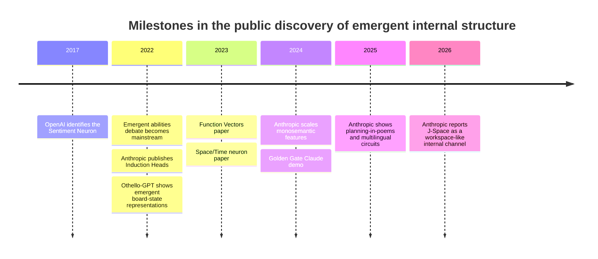

# Explaining Emergent Properties in Large Language Models

## Executive summary

For a general professional audience, the clearest way to explain **emergent properties in LLMs** is this: when you train a model at scale to predict the next token, it often invents **hidden internal concepts, shortcuts, and mini-algorithms** that nobody explicitly programmed. In other words, the visible task is “predict the next word,” but the model often solves that task by building internal variables for things like **sentiment, game state, task identity, space, time, future rhyme words, or a shared reasoning workspace**. That is the most intuitive and defensible nontechnical story behind emergence. citeturn7view3turn3view4turn6view0turn6view1turn6view2turn5view5

For LinkedIn, the most persuasive examples are usually **not** abstract benchmark graphs. They are concrete cases where researchers found a hidden internal representation and, in several cases, could **causally intervene** on it. That makes the story stronger: it is not just “the model behaves as if it knows something,” but “we found an internal handle for that concept, and changing it changes behavior.” citeturn3view4turn6view0turn6view1turn5view0turn3view2

A useful communication choice is to distinguish two meanings of “emergence.” One is **abrupt capability jumps with scale**, popularized by the 2022 “emergent abilities” literature. The other is **internal emergence**: representations or mechanisms that arise without being explicitly specified. For a broad audience, the second framing is more robust, because some claimed abrupt jumps can depend on how performance is measured, whereas the interpretability examples below document concrete internal structure. citeturn2search0turn2search1turn3view4turn6view1turn5view5

## A simple way to explain emergence

A nontechnical formulation that works well is:

> \\\*\\\*Emergence happens when a system trained for one narrow objective develops a more general internal structure than anyone directly asked for.\\\*\\\*

For LLMs, that means the training objective may be simple—predict the next token—but the shortest route to doing that well can require the model to invent **latent variables** that compress the world behind the text. Sentiment is useful for predicting reviews; board state is useful for predicting legal Othello moves; task vectors are useful for copying a demonstrated transformation; future rhyme targets are useful for finishing a poem; a shared “workspace” is useful for flexible reasoning across many different prompts. citeturn7view3turn3view4turn6view1turn5view0turn3view8

That yields a memorable simple line:

> \\\*\\\*LLMs are trained on text, but to predict text well they often learn hidden structure about the things text is about.\\\*\\\*

If you want one elegant takeaway sentence for a professional audience, this is the strongest candidate:

> \\\*\\\*Prediction pressure can produce representation.\\\*\\\*

That sentence is not a direct quote from the literature; it is an inference that summarizes the best-known examples below. citeturn7view3turn3view4turn6view0turn6view1turn6view2turn5view5

## Discovery milestones

The timeline above tracks when the best-known examples entered the public conversation: the OpenAI sentiment neuron in 2017; the “emergent abilities” framing, induction heads, and Othello-GPT in 2022; function vectors and space/time representations in 2023; scaled monosemantic features and Golden Gate Claude in 2024; Anthropic’s planning and multilingual circuit results in 2025; and the J-space workspace result in 2026. citeturn9search1turn2search0turn0search3turn0search2turn0search4turn1search0turn1search2turn1search16turn1search1turn0search0

## Comparison table

The table below is a **communication-oriented synthesis**, not a formal meta-analysis. “Evidence strength” is my judgment about how convincing each example is for a general audience, based mainly on whether the phenomenon is clear, interpretable, and supported by causal interventions.

|Example|Type|Evidence strength|Interpretability|Causal interventions demonstrated|Year and representative source|
|-|-|-|-|-|-|
|Sentiment Neuron|Representation|High|High|Yes|2017, OpenAI citeturn9search1turn9search0|
|J-Space|Representation + mechanism|Medium-high|Medium-high|Yes|2026, Anthropic citeturn0search0turn2search6|
|Othello-GPT|Representation|High|High|Yes|2022/2023, Li et al. citeturn3view4turn10search0|
|Induction Heads|Mechanism|Medium-high|Medium-high|Yes in small models; mixed in larger models|2022, Anthropic et al. citeturn6view0turn0search8|
|Function Vectors|Representation + mechanism|High|Medium-high|Yes|2023/2024, Todd et al. citeturn6view1turn6view5|
|Space/Time neurons|Representation|Medium|Medium|Limited / probe-based|2023/2024, Gurnee and Tegmark citeturn6view2turn1search4|
|Planning and rhyme representations|Mechanism|High|Medium-high|Yes|2025, Anthropic citeturn5view0turn5view1|
|Monosemantic features and Golden Gate Claude|Representation|Medium-high|Medium-high|Yes|2024, Anthropic citeturn8view0turn3view2|

## The strongest illustrative examples

### Sentiment Neuron

**Plain explanation.** A language model trained only to continue Amazon reviews ended up developing a single internal unit that strongly tracked whether a review was positive or negative. citeturn7view3turn9search0

**Why this is convincing evidence of emergence.** Nobody told the model “learn sentiment” as a separate objective. Sentiment appeared as a useful internal variable while the model was only trained to predict the next character, and OpenAI showed that directly changing that unit changed the tone of generated text. That is a textbook case of a hidden concept arising as a side effect of optimization. citeturn7view3turn9search0

**Everyday metaphor.** It is like opening a device that was only supposed to autocomplete reviews and discovering a hidden **mood dial** inside—and when you turn the dial, the writing becomes more positive or more negative.

**Priority sources.** [OpenAI research post](https://openai.com/index/unsupervised-sentiment-neuron/), [Radford et al. on arXiv](https://arxiv.org/abs/1704.01444), and [OpenAI demo code](https://github.com/openai/generating-reviews-discovering-sentiment). citeturn9search1turn9search0turn9search6

### J-Space

**Plain explanation.** Anthropic argues that Claude has a special internal subspace—the **J-space**—that acts like a shared mental workspace where information can be broadcast, flexibly reused, and used for higher-order reasoning. citeturn0search0turn5view5

**Why this is convincing evidence of emergence.** This is persuasive because the J-space appears to have a distinct functional role: Anthropic reports that Claude can still speak fluently and recall simple facts when J-space access is disrupted, but loses more complex higher-order cognition. They also report that J-space representations can be swapped and reused across different tasks, which is exactly the kind of flexibility people mean when they talk about an emergent internal workspace. citeturn3view8turn4view2turn4view4turn5view5

**Everyday metaphor.** Think of a company where most employees work in separate offices, but a few crucial ideas are sent through a shared **internal mailroom** that everyone can read from. The J-space is that mailroom.

**Priority sources.** [Anthropic research post](https://www.anthropic.com/research/global-workspace) and [full technical paper on Transformer Circuits](https://transformer-circuits.pub/2026/workspace/index.html). citeturn0search0turn2search6

### Othello-GPT

**Plain explanation.** A GPT model trained only to predict the next legal move in Othello developed an internal representation of the game board, even though it was never explicitly given the board state or the rules as a separate structure. citeturn3view4

**Why this is convincing evidence of emergence.** This example is especially strong because it is clean and controlled. The researchers found evidence that the model internally encoded board state, and intervention experiments showed they could alter that hidden state and change the model’s move behavior. So the model did not merely memorize sequences; it appears to have built a world representation usable for prediction. citeturn3view4turn10search0turn10search1

**Everyday metaphor.** It is like teaching someone only to continue chess notation and later discovering that they silently built the whole **board in their head**.

**Priority sources.** [Li et al. on arXiv](https://arxiv.org/abs/2210.13382), [ICLR OpenReview version](https://openreview.net/forum?id=DeG07_TcZvT), and [official code repository](https://github.com/likenneth/othello_world). citeturn10search2turn10search0turn10search1

### Induction Heads

**Plain explanation.** Researchers identified attention heads that implement a simple copying-and-continuation algorithm: if the model has seen a pattern like “A then B” before, those heads help it continue with “B” when “A” appears again. citeturn6view0turn0search8

**Why this is convincing evidence of emergence.** This matters because induction heads look like a reusable internal **mechanism** for in-context learning. The paper reports that they emerge at the same point in training as a sharp increase in in-context learning, with strong causal evidence in small attention-only models and correlational evidence in larger models. citeturn6view0

**Everyday metaphor.** Imagine a reader who notices, “Earlier in the document, when I saw this symbol, that other symbol came next,” and then uses that memory as a **copying rule** on the fly.

**Priority sources.** [Olsson et al. on arXiv](https://arxiv.org/abs/2209.11895) and [Transformer Circuits explainer](https://transformer-circuits.pub/2022/in-context-learning-and-induction-heads/index.html). citeturn6view0turn0search8

### Function Vectors

**Plain explanation.** Some models appear to store the “task being demonstrated” as a compact internal vector, so that the model can carry the task into a new context and perform it again. citeturn6view1turn6view5

**Why this is convincing evidence of emergence.** The striking result is that researchers could extract a function vector from examples, inject it elsewhere, and trigger the corresponding behavior—even in settings that did not look like the original prompt. That suggests the model formed an internal representation not just of text, but of the **transformation rule** behind the text. citeturn6view1turn6view5

**Everyday metaphor.** It is like watching someone do “English to Spanish” or “make antonyms,” then pulling out the hidden **recipe card** they used and slipping it into a different conversation.

**Priority sources.** [Todd et al. on arXiv](https://arxiv.org/abs/2310.15213), [project page](https://functions.baulab.info/), and [code repository](https://github.com/ericwtodd/function_vectors). citeturn6view1turn6view5turn0search19

### Space and Time Neurons

**Plain explanation.** Researchers found evidence that LLMs can internally organize information about places and dates in structured spatial and temporal directions, including individual units that correlate with location and time. citeturn6view2

**Why this is convincing evidence of emergence.** This is compelling because the model was trained on text, not on explicit maps or calendars as internal tables. Yet the authors found linear representations of geography and time across multiple scales and entity types, suggesting that the model had formed a reusable coordinate-like structure rather than just a pile of unrelated facts. citeturn6view2

**Everyday metaphor.** It is like reading enough travel stories and history books that your brain quietly builds an **internal map and timeline** without anyone ever handing you a wall map.

**Priority sources.** [Gurnee and Tegmark on arXiv](https://arxiv.org/abs/2310.02207) and [official code repository](https://github.com/wesg52/world-models). citeturn6view2turn1search4

### Planning and rhyme representations

**Plain explanation.** Anthropic found evidence that Claude sometimes plans the end of a poetic line in advance—such as a future rhyming word—and then writes earlier words to arrive there. citeturn3view1turn5view0

**Why this is convincing evidence of emergence.** This example is powerful because it directly challenges the simplistic picture that LLMs “only think one token ahead.” Anthropic reports that they could identify planned-word features active at the newline planning point and edit them so that the model restructured the next line accordingly, which is strong causal evidence of internal planning. citeturn5view0turn5view1turn4view9

**Everyday metaphor.** It is like a poet deciding on the last word of a line first and then writing the whole path to land there.

**Priority sources.** [Anthropic research post](https://www.anthropic.com/research/tracing-thoughts-language-model) and [full “Biology of a Large Language Model” paper](https://transformer-circuits.pub/2025/attribution-graphs/biology.html). citeturn1search1turn1search3

### Monosemantic features and Golden Gate Claude

**Plain explanation.** Anthropic used sparse autoencoders to isolate interpretable internal features in Claude, including one associated with the Golden Gate Bridge; when they amplified that feature, Claude started bringing up the bridge almost everywhere. citeturn8view0turn3view2

**Why this is convincing evidence of emergence.** This is compelling because it combines interpretation and intervention. Anthropic argues that large models contain many abstract, multilingual, multimodal features, and the Golden Gate demo made the idea tangible: if one meaningful feature is strengthened, behavior shifts in the direction that feature suggests. citeturn8view0turn3view2

**Everyday metaphor.** It is like discovering a hidden **Golden Gate slider** in a radio and finding that, once you push it up, every station somehow starts talking about San Francisco.

**Priority sources.** [Anthropic paper on scaling monosemanticity](https://arxiv.org/html/2605.29358v1), [Anthropic’s Golden Gate Claude demo post](https://www.anthropic.com/news/golden-gate-claude), and [Transformer Circuits summary page](https://transformer-circuits.pub/2024/scaling-monosemanticity/). citeturn8view0turn3view2turn1search2

## Caveats and limits

The main caveat is that **“emergence” is overloaded**. In one line of work, it means capabilities that appear abruptly as scale increases. In another, it means internal structures that arise without being directly specified. Those are related ideas, but they are not the same, and confusing them weakens the argument. For a LinkedIn post, it is better to say “hidden internal representations and mechanisms emerge” than to imply that all LLM progress is mysterious or discontinuous. citeturn2search0turn2search1turn3view4turn5view5

A second caveat is that some famous claims about “emergent abilities” may partially reflect **measurement artifacts**. Schaeffer, Miranda, and Koyejo argued that sudden jumps can appear because of nonlinear or discontinuous evaluation metrics, whereas smoother metrics often show gradual improvement instead. So if you discuss emergence publicly, it is wise to separate **benchmark emergence** from **mechanistic emergence**. citeturn2search1turn2search13

A third caveat is that not all examples have equal evidential status. Othello-GPT, function vectors, rhyme planning, and the sentiment neuron are unusually persuasive because they involve relatively clear internal handles and behavior-changing interventions. By contrast, space/time representations are intriguing but more probe-dependent, and the authors explicitly say further investigation is needed. Induction heads also come with a nuance: the paper reports strong causal evidence in small attention-only models, but only correlational evidence in larger models with MLPs. citeturn3view4turn6view1turn5view0turn9search0turn6view2turn6view0

A fourth caveat is that interpretability methods themselves are still imperfect. Anthropic’s J-space paper explicitly notes that the Jacobian lens is only an approximate tool, and the scaled monosemanticity paper says the extracted feature set is incomplete and lacks rigorous evaluation methods for full faithfulness. So these findings are best framed as **strong windows into model internals**, not complete maps. citeturn5view5turn8view0

Finally, one historical caveat: the **sentiment neuron** is not a transformer LLM in the modern sense; it came from a recurrent language model. It still matters because it is the clearest early demonstration of the pattern at the heart of this topic: optimize next-step prediction hard enough, and useful hidden concepts can appear. citeturn7view3turn9search0

## LinkedIn-ready takeaways and simple visuals

The simplest strategic choice for LinkedIn is to make one idea central:

> \\\*\\\*LLMs do not just memorize words; they often invent hidden concepts and internal tools to predict words better.\\\*\\\* That framing is vivid, accurate enough for a general audience, and well supported by the strongest examples in the literature. citeturn7view3turn3view4turn6view1turn5view0turn5view5

### Post variant one

**Headline:** LLMs are not just predicting words. They are inventing hidden structure.

**Hook:** One of the most interesting findings in AI is not that language models got bigger. It is that, while learning to predict the next token, they started developing internal concepts nobody explicitly programmed.

**Body:** OpenAI’s sentiment neuron, Othello-GPT’s hidden board state, Anthropic’s rhyme-planning circuits, and now J-space all point in the same direction: when prediction gets good enough, internal representations emerge. The real story may be less “magic intelligence appeared” and more “optimization discovered useful abstractions.” citeturn9search1turn3view4turn5view0turn0search0

### Post variant two

**Headline:** Prediction can create understanding-like structure

**Hook:** We trained models to predict the next word. They responded by inventing hidden dials for sentiment, task rules, spatial structure, and even future rhyme targets.

**Body:** That is why “emergence” is such an important idea in AI. The objective looks narrow, but the internal solution often turns out to be surprisingly rich. A useful mental model: LLMs compress the world behind the text, not just the text itself. citeturn7view3turn6view1turn6view2turn5view0

### Post variant three

**Headline:** The most surprising thing about LLMs may be what happens inside them

**Hook:** Some of the strongest evidence for emergence in AI is not in benchmark charts. It is inside the network.

**Body:** Researchers have found internal variables for sentiment, board state, multilingual concepts, planned rhyme words, and a workspace-like channel for higher-order reasoning. The implication is profound: next-token prediction can produce internal concepts that were never explicitly specified. citeturn7view3turn3view4turn4view8turn5view0turn5view5

### Post variant four

**Headline:** From next-token prediction to hidden world models

**Hook:** We asked models to guess the next token. In many cases, they seem to have solved that task by building something more general inside.

**Body:** That is what makes the idea of emergent properties so compelling. Sentiment neurons, function vectors, space/time representations, Golden Gate features, and J-space all suggest the same pattern: the shortest path to good prediction may be the invention of reusable internal structure. citeturn9search0turn6view1turn6view2turn3view2turn5view5

### Simple visuals that would work well

A strong LinkedIn visual should make the phenomenon legible in **one glance**. The best options are simple custom diagrams rather than dense paper figures.

|Visual idea|What it communicates|Why it works for LinkedIn|
|-|-|-|
|Hidden dial diagram|Input text → hidden “sentiment” dial → positive/negative output|Makes the sentiment neuron instantly understandable|
|Mailroom or switchboard diagram|Many specialist modules feeding one shared workspace|Best visual for J-space|
|Invisible board overlay|Sequence of Othello moves with a faded board appearing behind it|Shows “model built the board in its head”|
|Route-planning poem diagram|Future rhyme word shown first, earlier words tracing a route toward it|Makes “planning ahead” intuitive|
|Feature slider demo|Neutral response vs “Golden Gate slider up” response|Great for monosemantic features and causal steering|
|Map-and-timeline split visual|A map pin and a timeline line appearing behind plain text|Good for space/time representations|

If you want one single visual to anchor the whole post, the best choice is a **three-panel custom graphic**: **next-token training objective** on the left, **hidden internal structure emerging** in the center, and **visible behavior change when that structure is manipulated** on the right. That visual unifies almost all of the examples in this report. citeturn7view3turn3view4turn6view1turn5view0turn3view2turn5view5
