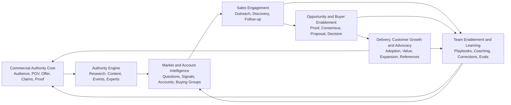

# Authority-to-Revenue: End-to-End Agentic Sales Solution

**Strategisches Lösungsbild für SoHo, SMB und Mid-Market**

**Strategisches Partner-Paper**: [[_outputs/authority-to-revenue-strategisches-business-paper-2026-08-03.pdf]]

## Executive Verdict

Eine größere agentische Sales-Lösung ergibt strategisch Sinn, wenn sie **nicht als KI-Verkäufer**, sondern als kommerzielles Wissens-, Entscheidungs- und Enablement-System verstanden wird.

Call Preparation allein ist zu klein. Sie löst einen sichtbaren Moment, aber nicht das eigentliche Problem: Fachwissen, Marktbeobachtung, Positionierung, Content, Accounts, Gespräche, Proof, Opportunities und Teamlernen sind voneinander getrennt. Gleichzeitig wäre ein „End-to-End Sales Agent“, der alle Stufen autonom bearbeitet, zu groß, riskant und unglaubwürdig.

Die überzeugende Produktthese lautet:

> **Ein Authority-to-Revenue Operating System verwandelt fachliche Expertise in belegbare Authority, Authority in relevante Käuferinteraktionen, Käuferinteraktionen in gemeinsamen Sales-Kontext und diesen Kontext in bessere Entscheidungen, Teamfähigkeiten und neue Proof Points.**

Das System verbindet damit drei bisher getrennte Nutzenversprechen:

1. **Authority Building:** Das Unternehmen oder seine Experten werden für ein enges, relevantes Problem erkennbar und glaubwürdig.
2. **Sales Execution:** Verkäufer erhalten für jeden kommerziellen Moment den passenden, belegten Kontext und eine kontrollierte nächste Aktion.
3. **Team Enablement:** Erkenntnisse, Proof, Einwände und wirksame Praktiken werden organisationsweit auffindbar, trainierbar und verbesserbar.

Der ehrliche Vorbehalt: Diese Kombination ist nur für beratungsintensive, wissens- und vertrauensabhängige B2B-Verkäufe plausibel. Für transaktionale, hochvolumige oder rein preisgetriebene Verkäufe wäre die Lösung wahrscheinlich zu schwer und ihr Authority-Anteil zu indirekt.

## 1. Authority Building als Grundbaustein: ja, aber anders

### Die starke Version der Idee

Authority Building ist ein sinnvoller Grundbaustein, weil komplexe B2B-Verkäufe selten erst mit dem ersten Verkäuferkontakt beginnen. Käufer müssen ein Problem verstehen, Alternativen einordnen, Risiken bewerten und intern Zustimmung herstellen. Ein evidenzgestützter Point of View, gute Erklärungen und belastbare Proof Assets können deshalb sowohl öffentliche Sichtbarkeit als auch konkrete Kaufentscheidungen unterstützen (source: [[strategic-thought-leadership-system]]; [[marketing-sales-and-buyer-enablement-library]]).

Die Wissensbasis des Second Brains kann dafür gleichzeitig dienen als:

- Evidence Library für belastbare Aussagen;
- Point-of-View- und Thesis-Library;
- Buyer-Question- und Objection-Library;
- Case-, Proof- und Reference-Library;
- Source Layer für Content, Events, Sales-Unterlagen und Buyer Enablement;
- Lernspeicher für Reaktionen, Korrekturen und neue Kundenfragen.

### Kritischer Check

Authority Building darf nicht mit Content-Produktion verwechselt werden. Mehr Posts, Newsletter oder Videos erzeugen weder automatisch Autorität noch Nachfrage. Der lokale [[niche-fame-content-loop]] verlangt eine eng definierte Zielgruppe, ein belegbares Territorium, gezielte Distribution und getrennte Evidenz für Aufmerksamkeit und kommerzielle Überschneidung. Ohne diese Begrenzung wird „Authority“ zur stilvollen Bezeichnung für eine Content-Maschine.

### Konsequenz

Der Grundbaustein sollte nicht „Content Engine“, sondern **Commercial Authority Core** heißen. Er enthält:

| Objekt | Zweck |
|---|---|
| Audience and Buying Context | Für wen und in welcher Entscheidungssituation ist die Expertise relevant? |
| Point of View | Welche begründete Überzeugung oder Praxis soll sich verändern? |
| Offer and Fit | Welches Problem löst das Angebot, für wen und wann ausdrücklich nicht? |
| Claim and Evidence Board | Was darf behauptet werden, mit welchem Beleg und welcher Einschränkung? |
| Buyer Question Map | Welche Fragen müssen vor, während und nach einer Kaufentscheidung beantwortet werden? |
| Proof Library | Cases, Demonstrationen, Referenzen, Daten und Implementierungsbelege |
| Voice and Story | Wie bleibt die öffentliche und verkäuferische Geschichte erkennbar konsistent? |

Dieser Core speist sowohl Authority Building als auch Sales. Der [[brand-and-abx-one-story-contract]] liefert die passende Grenze: ein stabiler belegter Kern, aber kontextabhängige Anpassung nach Rolle und Kaufsituation.

## 2. Das End-to-End-Modell

Die Lösung folgt nicht einem linearen Funnel. Käufer können zwischen öffentlicher Recherche, Empfehlungen, direktem Austausch, interner Abstimmung und formaler Evaluation wechseln. Das System braucht deshalb verknüpfte Loops statt einer starren Sequenz (source: Nonlinear Journey Question-Proof Map; [[marketing-sales-and-buyer-enablement-library]]).

### 2.1 Sense: Markt- und Käuferwissen

Das System sammelt nicht wahllos Inhalte, sondern beantwortet wiederkehrende kommerzielle Fragen:

- Welche Probleme, Trigger und Alternativen tauchen auf?
- Welche Fragen und Einwände wiederholen sich?
- Welche Rollen benötigen welchen Proof?
- Welche Account- oder Marktsignale verdienen Untersuchung?
- Welche öffentliche These ist relevant, aber noch unzureichend belegt?

Agentische Arbeit: Quellen innerhalb erlaubter Zonen suchen, Aussagen extrahieren, Widersprüche markieren, Evidenzlücken erkennen und Research-Aufgaben vorschlagen.

Menschliche Grenze: Bedeutung, Repräsentativität und kommerzielle Priorität bleiben menschliche Entscheidungen.

### 2.2 Build Authority: Expertise sichtbar und wiederverwendbar machen

Aus dem Commercial Authority Core entstehen:

- pointierte Fachbeiträge und Long-Form-Thesen;
- Newsletter, Videos, Webinare und Event-Beiträge;
- Buyer Guides, Vergleichshilfen und Self-Service-Material;
- Expertenprofile und wiedererkennbare Themenfelder;
- Sales Narratives, Executive Briefs und Proof Assets.

Agentische Arbeit: Evidence Packets zusammenstellen, Formate adaptieren, veraltete Claims erkennen, Distribution vorbereiten und Reaktionen zur Auswertung bündeln.

Menschliche Grenze: Point of View, Originalität, Reputation, Freigabe und Veröffentlichung. Das [[strategic-thought-leadership-system]] behandelt AI deshalb als begrenzte Adaptionshilfe, nicht als Ursprung glaubwürdiger Expertise.

### 2.3 Engage: Relevante Nachfrage und Accounts bearbeiten

Das System verbindet öffentliche Reaktionen, Empfehlungen, CRM-Historie, Account Research und bekannte Beziehungen. Es entscheidet nicht automatisch, dass Aktivität Kaufabsicht bedeutet. Es erzeugt stattdessen eine nachvollziehbare Arbeitshypothese:

- Warum könnte dieser Account oder Kontakt relevant sein?
- Welche Kaufsituation ist plausibel?
- Welche Information fehlt?
- Welche hilfreiche Interaktion ist angemessen?
- Wann sollte Kontakt unterbleiben?

Outputs reichen von einer warmen Einführung oder einem relevanten Content Share bis zu einer research-basierten Outreach-Hypothese. Massenhafte synthetische Personalisierung ist nicht der Kern.

### 2.4 Sell: Den gesamten Verkaufsprozess unterstützen

Call Preparation bleibt eine Capability, aber neben weiteren Sales Moments:

| Sales Moment | Agentischer Beitrag | Menschliche Verantwortung |
|---|---|---|
| Qualification | Fit-, Problem- und Beleglage zusammenstellen; Lücken markieren | qualifizieren oder disqualifizieren |
| Discovery | Rollen-, Frage-, Einwand- und Proof-Hypothesen vorbereiten | zuhören, interpretieren, Beziehung führen |
| Follow-up | Zusagen, offene Fragen und nächste Schritte aus erlaubten Notizen strukturieren | Ton, Richtigkeit und Versand freigeben |
| Objection handling | mögliche Ursachen, Diagnosefragen und belegte Antworten abrufen | Einwand verstehen und angemessen reagieren |
| Opportunity review | Fortschritts- und Gegenbelege, fehlende Rollen und Risiken sichtbar machen | Status, Priorität und Aktion entscheiden |
| Proposal / Business Case | bestätigte Entscheidungskriterien, Proof und Implementierungsannahmen zusammenführen | kommerzielles Angebot und Zusagen verantworten |
| Negotiation | Constraints, Trade-offs, Freigaben und Alternativen vorbereiten | verhandeln und verpflichten |
| Handoff | ein vollständiges, berechtigtes Kontextpaket erzeugen | Übergabe akzeptieren und Kundenversprechen halten |

Die Sales Enablement Translation ist hier das Kernverfahren: Signal → Diagnosefrage → sichere Antwort → Proof → nächste Aktion. Sie verhindert, dass generische Skripte an die Stelle von Discovery treten.

### 2.5 Enable the Buyer: Nicht nur Verkäufer produktiver machen

Eine vollständige Lösung muss dem Käufer helfen, intern zu entscheiden. Sie stellt rollen- und situationsgerechte Materialien bereit:

- Problem- und Entscheidungskriterien;
- ehrliche Fit- und Non-Fit-Bedingungen;
- Vergleiche und Alternativen;
- Risiko-, Security-, Legal- und Implementierungsinformationen;
- Business-Case-Bausteine;
- Proof für Nutzer, Entscheider und Prüfer;
- Material für interne Champions.

### Kritischer Check

Wenn die Lösung ausschließlich den Verkäufer optimiert, kann sie den Käufer mit effizienterer, aber weiterhin selbstbezogener Kommunikation belasten. Buyer Enablement ist daher ein notwendiges Korrektiv: Der Output muss eine Kundenentscheidung erleichtern, nicht nur eine Verkäuferaktivität beschleunigen.

### 2.6 Enable the Team: Die Compounding-Schicht

Team Enablement ist keine zusätzliche Featuregruppe. Es ist die Schicht, die aus individuellen Assistenten ein gemeinsames kommerzielles System macht.

Sie umfasst:

- gemeinsamer Commercial Authority Core;
- just-in-time Playbooks nach Sales Moment und Buying Context;
- Proof-, Objection- und Buyer-Question Libraries;
- rollenbezogenes Onboarding;
- realistische Practice- und Teach-back-Loops;
- Deal Collaboration und Expert Routing;
- Marketing–Sales–Customer-Success-Handoffs;
- Message Calibration aus bestätigtem Gesprächsfeedback;
- Win/Loss/No-Decision-Lernen;
- Skill- und Workflow-Evaluation statt Trainingsanwesenheit.

Der [[governed-ai-gtm-handoff-checklist|Governed AI GTM Handoff]] ist dafür zentral: Problem, Kontext, Provenienz, Owner, Zugriff, nächster Schritt und Proof müssen bei jeder Übergabe erhalten bleiben.

### Kritischer Check

Team Enablement kann schnell zu Überwachung werden. Call Scoring, Ranglisten oder vermeintliche Emotionserkennung gefährden Vertrauen und Lernbereitschaft. Das System sollte beobachtbare Arbeit gegen transparente Rubriken spiegeln, Korrekturen ermöglichen und keine Persönlichkeit diagnostizieren (source: [[marketing-sales-and-buyer-enablement-library]]).

### 2.7 Grow and Learn: Customer Success, Expansion und neue Authority

Nach dem Abschluss werden tatsächliche Implementierung, Adoption, Wert, Probleme und neue Käuferfragen zur wichtigsten Evidenzquelle. Sie speisen:

- bessere Proof Assets;
- realistischere Authority-Inhalte;
- Onboarding und Enablement;
- Produkt- und Angebotsverbesserungen;
- Renewal- und Expansion-Hypothesen;
- Customer Advocacy und Referenzen, sofern freigegeben.

Expansion darf nicht automatisch aus Nutzung oder Engagement abgeleitet werden. Erst bestätigter Wert, Customer Health, Beziehung, Kapazität und ein plausibles nächstes Problem rechtfertigen eine Opportunity-Hypothese (source: [[abm-customer-expansion-playbook]]).

## 3. Welche „Agents“ die Lösung braucht

Die Lösung braucht nicht zwingend acht getrennte Agent-Personas. Sie braucht acht **Capability Domains**, die ein orchestrierter Assistent oder mehrere spezialisierte Agenten je nach Rechten, Kontext und Skalierung ausführen können.

| Capability Domain | Kernjob | Typische Outputs |
|---|---|---|
| Market and Buyer Intelligence | relevante Veränderungen, Fragen und Evidenz erkennen | Research Brief, Question Map, Evidence Gap |
| Authority and POV | Expertise in belegbare, wiedererkennbare Assets übersetzen | Thesis, Evidence Pack, Content Packet |
| Account and Engagement | Accountkontext und angemessene Interaktion verbinden | Account Brief, Outreach Hypothesis, Contact Gate |
| Conversation | Gespräche vorbereiten und Nachbereitung strukturieren | Call Packet, Debrief, Follow-up Draft |
| Opportunity | Entscheidung, Rollen, Proof, Risiken und nächste Aktionen verbinden | Opportunity Review, Mutual Action Context |
| Buyer Enablement | interne Käuferentscheidung unterstützen | Role-specific Decision Pack |
| Team Enablement | Wissen in Playbooks, Practice und Handoffs überführen | Playbook, Coaching Prompt, Teach-back Rubric |
| Knowledge and Governance | Quellen, Aktualität, Rechte, Korrekturen und Evals pflegen | Claim Board, Staleness Queue, Run Log |

Ein zusätzlicher Customer-Growth-Modus kann auf derselben Architektur arbeiten. Separate Agents sind erst nötig, wenn unterschiedliche Berechtigungen, isolierte Kontexte, parallele Recherche oder unabhängige Prüfung einen messbaren Vorteil bieten (source: [[agentic-systems]]).

### 3.1 Wie das Produkt konkret aussieht

Die Capabilities sollten nicht als Sammlung von Chatbots erscheinen, sondern als zusammenhängende Arbeitsoberflächen über denselben kommerziellen Objekten.

| Produktoberfläche | Nutzerjob | Gemeinsame Objekte |
|---|---|---|
| Decision Queue | Was verdient heute Aufmerksamkeit, Freigabe oder Korrektur? | Aufgaben, Evidenzlücken, Freigaben, nächste Aktionen |
| Authority Studio | Welche belegbare Idee soll entwickelt, veröffentlicht oder wiederverwendet werden? | Thesen, Quellen, Claims, Formate, Reaktionen |
| Account and Opportunity Rooms | Was wissen wir, was vermuten wir und welche Entscheidung steht an? | Account, Buying Group, Verlauf, Proof, Risiken, Actions |
| Conversation Workbench | Wie bereiten wir einen Sales Moment vor und was lernen wir danach? | Context Packet, Fragen, Einwände, Zusagen, Debrief |
| Buyer Decision Room | Was benötigt der Käufer für Evaluation und interne Zustimmung? | Kriterien, Rollen, Proof, Risiken, Implementierung, Plan |
| Team Enablement Hub | Was soll das Team wissen, üben und wiederverwenden? | Playbooks, Cases, Rubriken, Experten, Lernfälle |
| Commercial Control Plane | Welche Quellen, Rechte, Regeln, Modelle und Workflows sind zulässig? | Rollen, Policies, Claims, Logs, Evals, Systemgrenzen |

CRM, E-Mail, Kalender, Content-Systeme, Dokumente und Analytics bleiben autoritative Fachsysteme, wo dies sinnvoll ist. Das Authority-to-Revenue OS ist die Kontext-, Orchestrierungs- und Lernschicht darüber; es darf nicht unbemerkt zum zweiten CRM werden.

### 3.2 Ein End-to-End-Nutzungstag

1. Die Decision Queue meldet eine relevante Marktfrage, zwei veraltete Proof Assets und eine bevorstehende Account-Entscheidung.
2. Das Authority Studio verbindet die Marktfrage mit einer vorhandenen These und schlägt ein belegtes Expertenformat vor.
3. Eine passende Reaktion oder Empfehlung wird als Account-Signal sichtbar, aber noch nicht als Kaufabsicht klassifiziert.
4. Der Account Room verbindet das Signal mit CRM-Historie, Buying Group und erlaubtem Proof.
5. Der Conversation Workbench erstellt Fragen und ein Context Packet; der Verkäufer korrigiert und führt das Gespräch.
6. Das Debrief aktualisiert nach Freigabe Accountwissen, Zusagen und offene Belegfragen.
7. Der Buyer Decision Room stellt dem Champion rollenbezogene Entscheidungshilfen bereit.
8. Ein wiederkehrender Einwand wird nicht sofort zum Playbook, sondern als Team-Lernfall vorgeschlagen.
9. Nach mehreren bestätigten Fällen aktualisiert der Enablement Owner das Playbook und der Authority Owner schärft die öffentliche These.

### Kritischer Check

Sieben Oberflächen klingen bereits wie eine Suite. Sie dürfen nicht als sieben getrennte Produkte entstehen. Der gemeinsame Wert liegt gerade darin, dass Thesis, Claim, Proof, Account, Buying Role, Sales Moment und Korrektur dieselben versionierten Objekte bleiben. Wenn jede Oberfläche eigene Kopien und Taxonomien erzeugt, verschärft die Lösung das Problem, das sie lösen soll.

## 4. Segmentierungsstrategie

### 4.1 Warum Unternehmensgröße allein nicht reicht

SoHo, SMB und Mid-Market sind operativ nützlich: Sie verändern Budget, Integrationsbedarf, Buying Committee, Servicebedarf und Governance. Sie erklären aber nicht ausreichend, **warum** die Lösung wertvoll ist. Ein zehnköpfiges Beratungsunternehmen kann mehr Authority- und komplexen Sales-Bedarf haben als ein 300-Personen-Unternehmen mit transaktionalem Verkauf.

### 4.2 Strategie-Turnier

Bewertung von 1 bis 5; alle Werte sind derzeit strategische Hypothesen, keine Marktforschung. `False-precision safety` bewertet, wie gut die Basis ohne erfundene Mikrogenauigkeit genutzt werden kann.

| Segmentierungsbasis | GTM-Leverage | Evidence Fit | B2B-Fit | Reachability | Differenzierung | Messbarkeit | False-precision safety | Gesamt / 35 |
|---|---:|---:|---:|---:|---:|---:|---:|---:|
| Unternehmensgröße: SoHo / SMB / Mid-Market | 2 | 3 | 3 | 5 | 2 | 5 | 2 | 22 |
| Outcome: weniger Suchaufwand / bessere Gespräche / schnelleres Enablement | 4 | 2 | 4 | 2 | 3 | 3 | 2 | 20 |
| AI-/RevOps-Reife | 4 | 3 | 4 | 3 | 3 | 4 | 3 | 24 |
| Buying Context und Sales Motion | 5 | 4 | 5 | 4 | 5 | 4 | 4 | **31** |
| Hybrid: Sales Motion plus Größe, Reife und beobachtbare Signale | 5 | 3 | 5 | 5 | 4 | 5 | 3 | **30** |

### Empfehlung

**Strategische Basis:** Buying Context und Sales Motion.

**Operationalisierung:** Hybrid Activation mit Unternehmensgröße, Systemreife und Teamstruktur.

Der gemeinsame Kernmarkt ist nicht „alle SMBs“, sondern:

> **Authority-abhängige, beratungsintensive B2B-Verkäufe, bei denen mehrere Interaktionen, erklärungsbedürftige Entscheidungen, wiederkehrende Buyer Questions und verteiltes kommerzielles Wissen den Erfolg beeinflussen.**

Gute Fit-Hypothesen:

- Expertise und Vertrauen beeinflussen die Shortlist.
- Das Angebot benötigt Erklärung, Diagnose oder Anpassung.
- Kaufentscheidungen umfassen mehrere Rollen oder interne Abstimmung.
- Sales-Zyklen erzeugen wiederverwendbare Fragen, Einwände und Proof-Bedarf.
- Wissen liegt in Köpfen, Content, CRM, E-Mails und Dokumenten verteilt.
- Verkäufer, Gründer oder Experten sind bereits sichtbare Träger der Glaubwürdigkeit.
- Der Kunde kann den Nutzen einer besseren Entscheidung höher bewerten als zusätzliche Outreach-Menge.

Schlechte Fit-Hypothesen:

- kurzer, rein transaktionaler oder preisgetriebener Verkauf;
- Wunsch nach maximalem automatisierten Outreach;
- kein unterscheidbarer Point of View und kein belastbarer Proof;
- keine verantwortliche Person für Claims, Daten und Enablement;
- fehlende Bereitschaft, Wissen oder Korrekturen zu teilen;
- Tool-Kauf soll ungelöste Prozess- oder Führungsprobleme verdecken.

## 5. Ein Kernel, drei Marktversionen

Die gleiche Wissens- und Capability-Architektur kann von SMB aus nach unten und oben skaliert werden. Die Wertoberfläche muss sich jedoch ändern.

| Dimension | SoHo / Founder-led | SMB | Mid-Market |
|---|---|---|---|
| Primärer Nutzer | Gründer, Partner, einzelner Seller | Sales Team, Head of Sales, Marketing | Sales, Enablement, RevOps, Marketing, CS |
| Kernproblem | Expertise sichtbar machen und in Gespräche überführen | Wissen und Ausführung im Team konsistent machen | funktionsübergreifenden Kontext und Governance verbinden |
| Authority-Träger | Person oder wenige Experten | Gründer plus SMEs und Brand | verteilte Experten, Brand und Account Teams |
| Hauptwert | Authority + persönliches Sales Memory | Team Enablement + Sales Execution + Authority | Governance + Integration + skalierbare Enablement- und Account-Workflows |
| Datenlage | Dateien, E-Mail, Kalender, leichtes CRM | CRM, Content, Notizen, Angebote, Teamwissen | mehrere Systeme, Rollen, Regionen und Policies |
| Buying Unit | Inhaber oder Partner | CEO / Head of Sales / Marketing | CRO, Sales Enablement, RevOps, Marketing, IT/Security |
| Produktform | einfacher Workspace und persönlicher Copilot | gemeinsamer Commercial Core und Team Workbench | kontrollierte Plattform, Integrationen, Rollen und Audit |
| Hauptrisiko | geringe Zahlungsbereitschaft und Pflegeabbruch | Adoption und Datenqualität | lange Beschaffung, Integration, Datenschutz und interner Wettbewerb |

### Strategisches Zentrum: SMB

SMB ist die plausibelste Mitte der Architektur. Hier gibt es bereits genug Team- und Prozesskomplexität für Enablement, aber häufig noch keine schwere Enterprise-Infrastruktur. SoHo ist die vereinfachte, personenorientierte Variante. Mid-Market ist keine bloß größere Lizenz, sondern benötigt einen stärkeren Control Plane für Rollen, Systeme, Audit, Freigaben und Change Management.

### Kritischer Check

Diese drei Varianten dürfen nicht gleichzeitig als ein identisches Produkt verkauft werden. Die gemeinsame Technologie kann modular sein; Käuferjob, Onboarding, Preislogik, Integration und Nachweis unterscheiden sich erheblich. „Von SMB nach oben und unten“ ist eine Architekturthese, noch keine Go-to-Market-Freigabe.

## 6. Die Team-Enablement-Schicht als Produktkern

Call Preparation ist ein nützliches Feature. Team Enablement ist das dauerhafte Betriebssystem.

Der Produktkern sollte deshalb fünf Teamjobs erfüllen:

1. **One Commercial Truth:** aktueller Point of View, Angebot, Claims, Proof, Fit und Non-Fit.
2. **Just-in-Time Enablement:** nicht ein statisches Playbook, sondern Kontext für den aktuellen Sales Moment.
3. **Expertise Routing:** der richtige interne Experte, Case oder Proof für Rolle und Entscheidung.
4. **Learning Transfer:** bestätigte Kundenfragen, Einwände und Korrekturen werden zu geprüften Teamressourcen.
5. **Capability Development:** Verkäufer üben beobachtbare Fähigkeiten an realistischen Fällen; Manager coachen mit transparenten Rubriken.

Das unterscheidet die Lösung von drei schwächeren Kategorien:

- **gegenüber einem Second Brain:** nicht nur Wissen speichern, sondern kommerzielle Arbeit ausführen und lernen;
- **gegenüber Sales Enablement Software:** nicht nur Assets verteilen und Training verwalten, sondern Kontext dynamisch zusammensetzen;
- **gegenüber einem AI-SDR:** nicht nur Kontakte und Nachrichten erzeugen, sondern Authority, Buyer Decision und Teamwissen verbinden.

## 7. Positionierung gegenüber Stefan

Eine glaubwürdige Erklärung wäre:

> Wir bauen keinen Roboter, der für dich verkauft. Wir bauen ein kommerzielles Betriebssystem, das eure beste Expertise sichtbar macht, sie in relevanten Verkaufssituationen verfügbar hält und aus echten Kundenreaktionen lernt. Es hilft einzelnen Verkäufern im Moment der Entscheidung und macht gleichzeitig das gesamte Team besser.

Die Kurzform:

> **Von Expertise zu Authority. Von Authority zu Gesprächen. Von Gesprächen zu Teamwissen. Von Teamwissen zu besseren Kundenentscheidungen.**

Mögliche Kategorienamen:

1. **Authority-to-Revenue OS** – stärkste strategische Geschichte, aber erklärungsbedürftig.
2. **Commercial Authority & Enablement OS** – präziser, etwas sperrig.
3. **Agentic Commercial Enablement** – modern, aber Gefahr von AI-Hype.
4. **Sales Second Brain** – leicht verständlich, aber zu stark nach persönlicher Notizablage klingend.

Empfehlung: intern **Authority-to-Revenue OS**, extern zunächst funktionsorientiert erklären und „agentic“ nur mit konkreten Capabilities belegen.

## 8. Was die Idee unglaubwürdig machen würde

- Ein einziger Super-Agent soll Marketing, Sales und Customer Success autonom übernehmen.
- Content-Volumen wird als Authority gemessen.
- Engagement wird als Kaufabsicht behandelt.
- Team Enablement wird zu verdecktem Performance Scoring.
- CRM-Daten werden kopiert, ohne Source-of-Truth-Regeln zu definieren.
- Buyer Enablement fehlt; alles dient nur Verkäuferproduktivität.
- Kundeninteraktionen werden ungeprüft zu allgemeinen Playbooks.
- SoHo, SMB und Mid-Market erhalten dasselbe Angebot mit anderen Nutzerlimits.
- Umsatzwirkung wird behauptet, bevor die beteiligten Entscheidungen und Handoffs messbar sind.
- Das Produkt braucht mehr Pflege, als es Such-, Abstimmungs- und Produktionsarbeit erspart.

## 9. Endgültige strategische Empfehlung

Die Idee ist überzeugender, wenn sie größer als Call Preparation, aber kleiner als „autonomer Vertrieb“ gedacht wird.

Das konsistente End-to-End-System besteht aus:

1. einem evidenzbasierten Commercial Authority Core;
2. einer Authority Engine für relevante, wiedererkennbare Expertise;
3. Market- und Account-Intelligence;
4. kontextgestützter Sales Execution über alle wichtigen Sales Moments;
5. Buyer Enablement für interne Kundenentscheidungen;
6. Team Enablement als Compounding-Schicht;
7. Customer-Value-, Expansion- und Advocacy-Lernen;
8. einem Governance- und Evaluation-Control-Plane.

Die beste Zieldefinition ist nicht Unternehmensgröße, sondern **Authority-abhängiger komplexer B2B-Verkauf**. Unternehmensgröße bestimmt danach Packaging und Betriebsmodell:

- SoHo: persönliche Authority und persönliches Commercial Memory;
- SMB: gemeinsames Sales- und Enablement-System als strategischer Kern;
- Mid-Market: integriertes, rollenbasiertes Commercial Context System.

Damit wird auch Rolfs ursprüngliches Second-Brain-Ziel nicht verwässert. Authority Building ist der öffentliche Ausdruck des Wissenssystems; Sales Enablement ist seine private Anwendung; Teamlernen ist der Mechanismus, durch den beides mit jeder realen Käuferinteraktion besser werden kann.

## Offene Beweisfragen

- Welche enge fachliche Authority-Territory kann Stefan glaubwürdig besitzen?
- Ist Stefan primär Verkäufer, Experte mit Vertriebsfunktion oder potenzieller Solution Owner?
- Welche Käuferprobleme benötigen sowohl Aufklärung als auch menschliche Verkaufsführung?
- Welche Teamjobs unterscheiden sich wirklich zwischen SoHo, SMB und Mid-Market?
- Wer besitzt im SMB den Commercial Authority Core: Sales, Marketing oder Geschäftsführung?
- Welche Daten bleiben autoritativ im CRM, welche im Second Brain und welche nur als Verweis?
- Welche Capability schafft Käuferwert und nicht nur Verkäufereffizienz?
- Welche Entscheidungen dürfen Agents vorbereiten, welche ändern und welche nie selbst treffen?

## Related pages

- [[_outputs/second-brain-enabled-agentic-sales-enablement-strategiepapier-2026-08-03|Second-Brain-enabled Agentic Sales Enablement]]
- [[strategic-thought-leadership-system]]
- [[niche-fame-content-loop]]
- [[brand-and-abx-one-story-contract]]
- [[ai-native-gtm-operating-model]]
- [[governed-ai-gtm-handoff-checklist]]
- [[marketing-sales-and-buyer-enablement-library]]
- [[agentic-systems]]
- [[revenue-operations-ai-readiness]]
