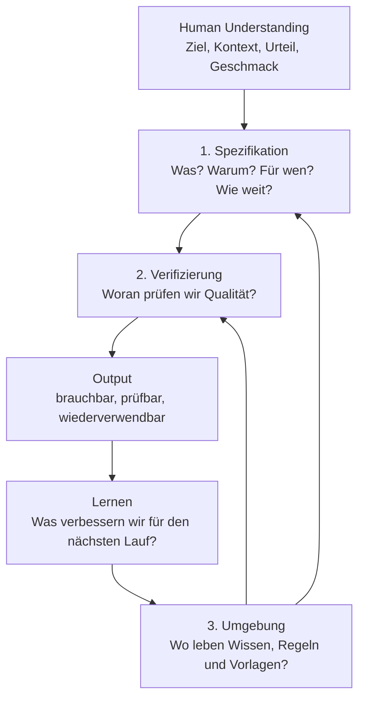

# AI Work Blueprint

**Summary**: Ein universeller Arbeitsrahmen für gute KI-Zusammenarbeit: erst das eigentliche Ziel klären, dann einen prüfbaren Arbeitsauftrag formulieren, dann die wiederverwendbare Arbeitsumgebung verbessern.

---

## Der Kern in einem Satz

KI ist stark in Ausführung, Mustererkennung, Formulierung und Variantenbildung, aber sie kennt dein Ziel, deinen Kontext und deine Qualitätsgrenze nicht automatisch. Dieser Blueprint übersetzt dein menschliches Verständnis in drei Dinge, mit denen KI arbeiten kann: **Spezifikation**, **Verifizierung** und **Umgebung** (source: pasted-text.txt).

Der präzisere Name für diese Arbeitsweise ist **Context Engineering**: Nicht der perfekte Einzelprompt ist das Ziel, sondern ein Arbeitsraum, in dem Ziel, Quellen, Regeln, Beispiele, Prüfungen und Grenzen so gut vorbereitet sind, dass KI weniger raten muss (source: The Karpathy Method Blueprint (1).docx).

## Die drei Leitfragen

Wenn du nur eine Kurzform behalten willst, nimm diese:

| Frage | Layer | Bedeutung |
|---|---|---|
| **Was soll wirklich passieren?** | Spezifikation | Ziel, Kontext, Scope und gewünschtes Ergebnis klären. |
| **Woran erkenne ich, dass es gut ist?** | Verifizierung | Kriterien, Gegenchecks und Realitätssignale festlegen. |
| **Was soll beim nächsten Mal schon vorbereitet sein?** | Umgebung | Wissen, Regeln, Vorlagen und Skills dauerhaft ablegen. |

## Visual Map



## Metapher

Denke an eine Werkstatt:

| Layer | Bild | Job |
|---|---|---|
| Spezifikation | Bauplan an der Wand | Macht Ziel, Kontext, Grenzen und Output klar. |
| Verifizierung | Qualitätsstation am Ausgang | Prüft, ob das Ergebnis wirklich taugt. |
| Umgebung | Die Werkstatt selbst | Sammelt Werkzeuge, Regeln, Wissen und Routinen. |

Der häufigste Fehler ist, KI direkt arbeiten zu lassen, bevor klar ist, was gebaut wird und woran Qualität erkannt wird. Der bessere Ablauf ist: erst Bauplan, dann Qualitätscheck, dann Werkstatt verbessern.

## Wann du den Blueprint nutzt

Nutze ihn bei Aufgaben, die wichtig, wiederholbar, mehrstufig oder schwer zu beurteilen sind:

- Research, Deep Research, Quellenarbeit und Synthesen
- Reports, Präsentationen, Briefings und Entscheidungsvorlagen
- Marketingstrategie, Kampagnen, Personas und Content
- Produktideen, PRDs, Prozessdesign und Projektplanung
- Coding, Automatisierung, Datenanalyse und Tool-Building
- Lernen, persönliche Wissensarbeit und Second-Brain-Pflege

Für einfache Einmalfragen ist der volle Blueprint zu schwer. Dann reicht oft nur die Kurzform: Ziel sagen, gewünschtes Format nennen, Ergebnis prüfen.

## Layer 1: Spezifikation

Die Spezifikation ist nicht einfach ein langer Prompt. Sie ist der Moment, in dem du dein Verständnis in eine Form bringst, die eine KI ausführen kann.

Eine Aufgabe wie "Erstelle einen Monatsreport" ist noch keine gute Spezifikation. Eine bessere Spezifikation erklärt, welche Entscheidung der Report unterstützen soll, wer ihn liest, welche Quellen gelten, welche Teile nicht bearbeitet werden sollen und wann ein erster Zwischenstand geprüft wird (source: pasted-text.txt).

### Reifegrade einer Spezifikation

| Reifegrad | Bedeutung | Wann sinnvoll |
|---|---|---|
| Spec-first | Die Spezifikation wird vor der Ausführung erstellt. | Für neue Aufgaben, bei denen Ziel und Grenzen erst klar werden müssen. |
| Spec-anchored | Die Spezifikation bleibt während der Arbeit lebendig und wird bei Änderungen aktualisiert. | Für Projekte, die mehrere Iterationen, Reviews oder Beteiligte haben. |
| Spec-as-source | Die Spezifikation wird zur primären Steuerdatei; Umsetzung folgt daraus. | Für wiederkehrende oder technische Workflows, bei denen Konsistenz wichtiger ist als spontane Ausführung. |

Der erste Reifegrad reicht für die meisten Alltagsaufgaben. Die höheren Reifegrade lohnen sich, wenn Arbeit wiederholt, automatisiert, delegiert oder später geprüft werden soll (source: pasted-text.txt; source: The Karpathy Method Blueprint (1).docx).

### Was eine gute Spezifikation enthält

| Baustein | Leitfrage |
|---|---|
| Ziel | Welche Entscheidung, Einsicht oder Handlung soll dadurch möglich werden? |
| Nutzer | Wer verwendet das Ergebnis, und was braucht diese Person wirklich? |
| Kontext | Was weiß ich, was die KI nicht automatisch wissen kann? |
| Quellen | Welche Dateien, Links, Daten oder Notizen sind erlaubt? |
| Grenzen | Was gehört ausdrücklich nicht dazu? |
| Output | Welche Form, Länge, Struktur, Sprache oder Tonalität wird gebraucht? |
| Erster Schnitt | Was ist der kleinste sinnvolle Zwischenschritt zur Prüfung? |
| Entscheidungen | Welche Punkte muss ich selbst freigeben? |

### Spezifikations-Prompt

```text
Interviere mich zuerst, um das eigentliche Ziel dieser Aufgabe herauszuarbeiten.

Hilf mir danach, eine kleine und prüfbare Spezifikation zu formulieren.
Arbeite nicht im Wasserfall. Schlage einen ersten sinnvollen Zwischenschritt vor,
den ich prüfen kann, bevor du weiterarbeitest.

Am Ende brauche ich:
1. Ziel und gewünschte Entscheidung
2. Nutzer oder Publikum
3. relevanten Kontext
4. erlaubte Quellen
5. Grenzen und Nicht-Ziele
6. gewünschtes Output-Format
7. ersten Checkpoint
8. Entscheidungen, die ich bestätigen muss
```

### Fragen nach Abhängigkeiten führen

Ein Spezifikationsinterview muss nicht starr eine Frage pro Runde stellen. Behandle offene Fragen als Abhängigkeitsgraph: Stelle einen Blocker allein, wenn seine Antwort weitere Fragen bestimmt; bündele ansonsten nur die Fragen, die auf dem aktuellen Wissensstand unabhängig beantwortbar sind. Nach jeder Runde wird die nächste beantwortbare Fragenfront sichtbar. So reduziert das Interview unnötige Turns, ohne spätere Entscheidungen vorwegzunehmen (source: 2026-08-05--gaDdrDdczO4.md; practitioner method).

Wenn eine Antwort einer anderen beteiligten Person gehört, exportiere die betroffenen offenen Fragen in ein prüfbares Dokument. Übernimm anschließend nur die gemeinsam bestätigten Antworten mit Verantwortlichkeit und Provenienz zurück in die Spezifikation. Formuliere materielle Fragen neutral: vorgeschlagene Antworten können Zustimmung begünstigen und ersetzen weder Entscheidungseigentum noch menschliches Urteil (source: 2026-08-05--gaDdrDdczO4.md; analysis).

## Layer 2: Verifizierung

Der Verifizierer beantwortet die Frage: **Woran erkennen wir, dass das Ergebnis gut genug ist?**

Das ist mehr als Faktencheck. Je nach Aufgabe prüfst du auch Zweckmäßigkeit, Struktur, Tonalität, Vollständigkeit, Umsetzbarkeit, Risiko, Anschlussfähigkeit und Quellenlage. "Mach es besser" ist kein Verifizierer. "Jede Empfehlung muss auf eine Quelle, eine Begründung und eine nächste Aktion zurückgeführt werden können" ist einer.

### Drei Arten von Prüfung

| Prüfart | Zweck | Beispiele |
|---|---|---|
| Kriterien | Vorher festlegen, was gut heißt. | Muss 3 Optionen vergleichen; jede Option mit Empfehlung; keine unbelegten Zahlen. |
| Kritik | Ergebnis aus einer zweiten Perspektive angreifen. | Zweites Modell, Reviewer-Rolle, Gegenargumente, Red-Team-Fragen. |
| Externes Signal | Mit Realität oder Referenzen abgleichen. | Quelldokumente, Tabellen, alte Reports, Brand Guidelines, Tests, APIs, Browser-Check. |

### Verifizierungs-Prompt

```text
Bevor du den finalen Output erstellst, definiere die Bewertungskriterien.

Prüfe den Output danach gegen diese Kriterien und markiere:
1. unbelegte oder unsichere Aussagen
2. Annahmen
3. fehlenden Kontext
4. Widersprüche
5. Stellen, die menschliches Urteil brauchen
6. externe Signale, die die Sicherheit erhöhen würden
7. konkrete Verbesserungen vor dem nächsten Schritt
```

Für wiederverwendbare oder externe Arbeit verbindet sich diese Schicht mit [[ai-marketing-workflow-assurance]]: Dort wird festgehalten, welche Quellen genutzt wurden, welche Bewertung stattgefunden hat und ob ein Ergebnis nur ein Entwurf oder wirklich freigegeben ist.

Die neuen Agentic-Clippings passen in denselben Blueprint: [[claude-subagents]] helfen, spezialisierte Arbeit mit frischem Kontext auszuführen; [[loop-engineering]] braucht eine besonders klare Spezifikation und einen prüfbaren Stop-Zustand; [[ai-operating-system]] beschreibt die dauerhafte Umgebung aus Kontext, Verbindungen, Fähigkeiten und Kadenz (source: How to Build Claude Subagents Better Than 99% of People.md; source: Only the best are using them.md; source: I Turned Claude Fable Into The Ultimate Second Brain.md).

Die Juni-2026-Quellen ergänzen zwei praktische Regeln: Kontext aktiv reduzieren, auslagern und isolieren; und Schleifen nur dann autonom laufen lassen, wenn Ziel, Verifizierer, Budget und Abbruchbedingung explizit sind (source: AI Agent Harness, 3 Principles for Context Engineering, and the Bitter Lesson Revisited.md; source: Stop Prompting Claude. Start Loop Engineering.md).

## Layer 3: Umgebung

Die Umgebung verhindert, dass du bei jedem Prompt wieder bei null anfängst. Sie ist der dauerhafte Rahmen um die Arbeit: Regeln, Wissensbasis, Vorlagen, Beispiele, Skills, Logs und Guardrails.

In diesem Vault besteht die Umgebung aus AGENTS.md, `raw/`, `research/`, `wiki/`, `templates/`, `wiki/_outputs/`, Quellenregistern und Logs (vault governance: AGENTS.md). In anderen Kontexten kann die Umgebung ein Projektordner, ein Team-Wiki, ein CRM, ein Code-Repo, ein Notion-Space oder ein Set aus wiederverwendbaren Prompts sein.

### Die vier Subsysteme der Umgebung

| Subsystem | Zweck | Beispiel |
|---|---|---|
| Operating instructions | Dauerhafte Arbeitsregeln und Projektkarte. | AGENTS.md, CLAUDE.md, Repo-Regeln, Team-Prinzipien. |
| Knowledge base | Kompilierte, verlinkte Wissensbasis statt jedes Mal Rohmaterial neu lesen. | `raw/` als Quelle, `wiki/` als synthetisierte Wissensschicht. |
| Procedural skills | Wiederholbare Abläufe als Skills, Playbooks oder Scripts. | `skills/ai-spec-builder`, Review-Checklisten, Import-Routinen. |
| Deterministic guardrails | Harte Grenzen, die nicht nur im Prompt stehen. | Dateirechte, Pre-tool-Hooks, Freigabe-Gates, geschützte Ordner. |

Eine gute Umgebung ist deshalb nicht einfach "mehr Kontext". Sie ist ein System aus Gedächtnis, Verfahren und Grenzen. Je teurer ein Fehler wäre, desto weniger sollte die Grenze nur als Bitte im Prompt existieren (source: pasted-text.txt; source: The Karpathy Method Blueprint (1).docx).

### Was in die Umgebung gehört

| Element | Zweck |
|---|---|
| Arbeitsregeln | Was soll die KI immer tun, fragen oder nie tun? |
| Wissensbasis | Wo liegen Quellen, Referenzen, Beispiele und geprüfte Synthesen? |
| Vorlagen | Welche Aufgaben kommen oft genug vor, dass sie ein Template verdienen? |
| Skills oder Playbooks | Welche wiederholbaren Abläufe brauchen eigene Schritt-für-Schritt-Regeln? |
| Beispiele | Welche guten Outputs zeigen Form, Ton und Qualitätsniveau? |
| Guardrails | Welche Fehler müssen verhindert statt nur ermahnt werden? |
| Lernlog | Was wurde verbessert, damit der nächste Lauf besser startet? |

### Guardrail-Buckets

| Bucket | Bedeutung | Beispiel für diesen Vault |
|---|---|---|
| Always do | Darf oder soll die KI automatisch tun. | Quellen zitieren, relevante Wiki-Links setzen, Log nach Ingest aktualisieren. |
| Ask first | Benötigt menschliche Entscheidung. | Mehrere Seiten umstrukturieren, unsichere Kategorien wählen, Claims zu dauerhaftem Wissen machen. |
| Never do | Harte Grenze. | Dateien in `raw/` verändern oder AI-Research stillschweigend als Primärquelle behandeln. |

### Environment Audit Prompt

```text
Prüfe meine AI-Arbeitsumgebung:
1. Arbeitsregeln
2. Wissensbasis
3. Vorlagen und Skills
4. Verifizierungsroutinen
5. Guardrails

Nenne die 5 wichtigsten Lücken. Für jede Lücke:
- betroffene Datei oder Stelle
- konkretes Problem
- exakte Verbesserung
- ob es Always do, Ask first oder Never do ist
- ob eine harte Sperre statt nur einer Prompt-Regel nötig ist
```

## Der Ablauf als Routine

```text
1. Ziel klären: Was soll wirklich passieren?
2. Spezifikation schreiben: Kontext, Quellen, Grenzen, Output, erster Schnitt.
3. Entscheidungen bestätigen: Was darf die KI annehmen, was nicht?
4. Verifizierung festlegen: Woran wird Qualität gemessen?
5. Ersten Schnitt ausführen: klein genug, um sinnvoll zu prüfen.
6. Prüfen und verbessern: Kriterien, Kritik, externes Signal.
7. Umgebung aktualisieren: Vorlage, Regel, Skill, Wiki-Seite oder Log ergänzen.
```

### Readiness-Vertrag an Übergaben

Wenn mehrere Stufen oder Sessions beteiligt sind, braucht jedes Übergabeartefakt zusätzlich einen expliziten Readiness-Status, Quellen und Provenienz, gesetzte Entscheidungen, verworfene Alternativen, offene Blocker und Verifizierungsevidenz. Die nächste Stufe darf `requirements-only`, `blocked`, unbekannte Statuswerte oder fehlende Verifizierung nicht stillschweigend als ausführungsbereit interpretieren. Sie stoppt und fordert Klärung an. Ein Handoff überträgt Kontext, aber keine neue Handlungsbefugnis (source: README.md; source: SKILL.md; analysis based on the GStack staged workflow and Compound Engineering LFG contract).

## Mini-Version für den Alltag

Wenn du schnell starten willst, nutze diese vier Sätze:

```text
Ziel: Ich will erreichen, dass ...
Kontext: Wichtig ist dabei ...
Output: Gib mir bitte ...
Prüfung: Achte besonders auf ... und markiere Unsicherheiten.
```

## Beispiele

### Monatsreport

- Spezifikation: Welche Entscheidung soll der Report ermöglichen, welcher Zeitraum gilt, welche Datenquellen sind verbindlich?
- Verifizierung: Zahlen gegen Tabellen prüfen, jede Schlussfolgerung mit Quelle oder Annahme markieren, jede Sektion mit Empfehlung beenden.
- Umgebung: Report-Struktur als Vorlage speichern und mit [[campaign-reporting-and-operations]] verlinken.

### Marketing-Brief

- Spezifikation: Business-Ziel, Zielgruppe, gewünschtes Verhalten, Botschaft, Deliverables, Timing und Grenzen klären.
- Verifizierung: Gegen Brand Guidelines, Persona-Quellen, alte gute Briefings und Content-Qualitätskriterien prüfen.
- Umgebung: Wiederkehrende Brief-Muster in [[briefing-system]] oder `templates/` überführen.

### Research-Synthese

- Spezifikation: Forschungsfrage, erlaubte Quellen, Aktualitätsanforderung und gewünschte Entscheidung klären.
- Verifizierung: Primärquellen bevorzugen, ungesicherte Aussagen markieren, Widersprüche explizit notieren.
- Umgebung: Source Summary, Konzeptseite, offene Fragen und Log aktualisieren.

### Coding oder Automatisierung

- Spezifikation: Nutzerfluss, gewünschtes Verhalten, technische Grenzen und erstes kleines Inkrement beschreiben.
- Verifizierung: Tests, Lint, Browser-Check, Logs oder reale API-Antworten nutzen.
- Umgebung: README, Tests, Agent-Regeln oder Skripte verbessern, wenn derselbe Fehler wieder auftaucht.

## Spec-anchored semantic ingest

The semantic-ingest workflow is a concrete `spec-anchored` implementation of this blueprint. Its schema and package manifest preserve the specification, its evidence matrix makes the knowledge delta reviewable, and its validator turns source identity, citation coverage, register updates, backlog state, and raw immutability into deterministic gates (vault governance: AGENTS.md; analysis: [[semantic-ingest-workflow]]). Fast and Full validation profiles separate iteration cost from closure assurance, while recorded artifact hashes make the final validation state auditable. The workflow also preserves environment learning through a generic skill-validator fallback, a preconditioned transactional edit fallback, and a separate line-ending audit (source: tools/test-semantic-ingest-package.ps1; source: tools/validate-local-skill.ps1; source: tools/set-file-transactional.ps1; analysis: [[semantic-ingest-workflow]]).

## AI-Ausgaben als aktive Lernfläche

Bei unbekannten oder fachlich neuen Ergebnissen bleiben Architektur und Abnahme beim Menschen. Lass die KI die Lösung in klarer Sprache erklären, verlange belastbare Dokumentation und sichtbare Trade-offs, vergleiche sie mit der eigenen Alternative und integriere sie erst, wenn der verantwortliche Mensch die Logik selbst zurückerklären kann. So wird die Ausgabe zur Lernfläche statt zu einer Black Box (source: 2026-07-27--tHh0UaL_V4w.md; practitioner discussion; analysis: P38-W6R3-C01).

Das ist eine konkrete Erweiterung des bestehenden „thinking with AI“-Prinzips. Aussagen der Quelle über einzelne Modelle, Benchmarks, Arbeitsmarkt, Finanzen, Energie, Politik oder Prognosen werden nicht übernommen.

## Goldene Regel

Du kannst Ausführung an KI delegieren, aber nicht dein Verständnis. Die KI kann schreiben, rechnen, vergleichen, umbauen und Varianten erzeugen. Du bleibst verantwortlich für Ziel, Kontext, Urteil, Grenzen und Freigabe.

## Open questions

- Welche wiederkehrenden Rolf-Workflows verdienen zuerst eine eigene Skill- oder Template-Version?
- Welche Verifizierung sollte automatisiert werden, statt nur als Prompt-Regel zu existieren?
- Welche Teile dieses Blueprints sollten nach praktischer Erprobung in AGENTS.md wandern?

## Related pages

- [[karpathy-spec-verifier-environment-source-summary]]
- [[context-engineering]]
- [[agentic-prompting]]
- [[ai-marketing-workflow-assurance]]
- [[personal-ai-cowork-system]]
- [[ai-operating-system]]
- [[claude-subagents]]
- [[loop-engineering]]
- [[llm-wiki]]
- [[production-agent-engineering-clippings-june-2026]]
- [[ai-workflow-builder-clippings-june-2026]]
- [[semantic-ingest-workflow]]
